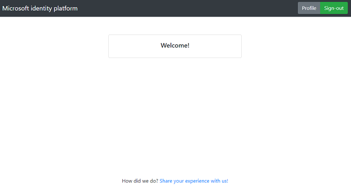

# A Node.js & Express web app authenticating users against Azure AD with MSAL Node

 1. [Overview](#overview)
 1. [Scenario](#scenario)
 1. [Contents](#contents)
 1. [Prerequisites](#prerequisites)
 1. [Setup](#setup)
 1. [Registration](#registration)
 1. [Running the sample](#running-the-sample)
 1. [Explore the sample](#explore-the-sample)
 1. [About the code](#about-the-code)
 1. [More information](#more-information)
 1. [Community Help and Support](#community-help-and-support)
 1. [Contributing](#contributing)

## Overview

This sample demonstrates a Node.js & Express web application that authenticates users against Azure AD, with the help of [Microsoft Authentication Library for Node.js](https://aka.ms/msalnode) (MSAL Node). In doing so, it illustrates authentication concepts such as [OpenID scopes](https://docs.microsoft.com/azure/active-directory/develop/v2-permissions-and-consent#openid-connect-scopes), [ID Tokens](https://docs.microsoft.com/azure/active-directory/develop/id-tokens), [ID Token validation](https://docs.microsoft.com/azure/active-directory/develop/id-tokens#validating-an-id_token) and more.

## Scenario

1. The client application uses **MSAL Node** (via [msal-express-wrapper](https://github.com/Azure-Samples/msal-express-wrapper)) to obtain an ID Token from **Azure AD**.
2. The **ID Token** proves that the user has successfully authenticated against **Azure AD**.


## Contents

| File/folder                 | Description                                                   |
|-----------------------------|---------------------------------------------------------------|
| `AppCreationScripts/`       | Contains Powershell scripts to automate app registration.     |
| `ReadmeFiles/`              | Contains illustrations and screenshots.                       |
| `App/appSettings.json`      | Authentication parameters and settings                        |
| `App/app.js`                | Application entry point.                                      |

## Prerequisites

- [Node.js](https://nodejs.org/en/download/) must be installed to run this sample.
- [Visual Studio Code](https://code.visualstudio.com/download) is recommended for running and editing this sample.
- A modern web browser. This sample uses **ES6** conventions and will not run on **Internet Explorer**.
- An **Azure AD** tenant. For more information, see: [How to get an Azure AD tenant](https://docs.microsoft.com/azure/active-directory/develop/quickstart-create-new-tenant)
- A user account in your **Azure AD** tenant. This sample will not work with a **personal Microsoft account**.  If you're signed in to the [Azure portal](https://portal.azure.com) with a personal Microsoft account and have not created a user account in your directory before, you will need to create one before proceeding.

## Setup

### Step 1: Clone or download this repository

From your shell or command line:

```console
    git clone https://github.com/Azure-Samples/ms-identity-javascript-nodejs-tutorial.git
```

or download and extract the repository .zip file.

> :warning: To avoid path length limitations on Windows, we recommend cloning into a directory near the root of your drive.

### Step 2: Install project dependencies

Locate the root of the sample folder. Then:

```console
    cd 1-Authentication\1-sign-in\App
    npm install
```

## Registration

There is one project in this sample. To register it, you can:

- follow the steps below for manually register your apps
- or use PowerShell scripts that:
  - **automatically** creates the Azure AD applications and related objects (passwords, permissions, dependencies) for you.
  - modify the projects' configuration files.

<details>
  <summary>Expand this section if you want to use this automation:</summary>

> :warning: If you have never used **Azure AD Powershell** before, we recommend you go through the [App Creation Scripts](./AppCreationScripts/AppCreationScripts.md) once to ensure that your environment is prepared correctly for this step.

1. On Windows, run PowerShell as **Administrator** and navigate to the root of the cloned directory
1. If you have never used Azure AD Powershell before, we recommend you go through the [App Creation Scripts](./AppCreationScripts/AppCreationScripts.md) once to ensure that your environment is prepared correctly for this step.
1. In PowerShell run:

   ```PowerShell
   Set-ExecutionPolicy -ExecutionPolicy RemoteSigned -Scope Process -Force
   ```

1. Run the script to create your Azure AD application and configure the code of the sample application accordingly.
1. In PowerShell run:

   ```PowerShell
   cd .\AppCreationScripts\
   .\Configure.ps1
   ```

   > Other ways of running the scripts are described in [App Creation Scripts](./AppCreationScripts/AppCreationScripts.md)
   > The scripts also provide a guide to automated application registration, configuration and removal which can help in your CI/CD scenarios.

</details>

### Choose the Azure AD tenant where you want to create your applications

As a first step you'll need to:

1. Sign in to the [Azure portal](https://portal.azure.com).
1. If your account is present in more than one Azure AD tenant, select your profile at the top right corner in the menu on top of the page, and then **switch directory** to change your portal session to the desired Azure AD tenant.

### Register the client app (msal-node-webapp)

1. Navigate to the [Azure portal](https://portal.azure.com) and select the **Azure AD** service.
1. Select the **App Registrations** blade on the left, then select **New registration**.
1. In the **Register an application page** that appears, enter your application's registration information:
   - In the **Name** section, enter a meaningful application name that will be displayed to users of the app, for example `msal-node-webapp`.
   - Under **Supported account types**, select **Accounts in this organizational directory only**.
   - In the **Redirect URI (optional)** section, select **Web** in the combo-box and enter the following redirect URI: `http://localhost:4000/redirect`.
1. Select **Register** to create the application.
1. In the app's registration screen, find and note the **Application (client) ID**. You use this value in your app's configuration file(s) later in your code.
1. Select **Save** to save your changes.
1. In the app's registration screen, select the **Certificates & secrets** blade in the left to open the page where you can generate secrets and upload certificates.
1. In the **Client secrets** section, select **New client secret**:
   - Type a key description (for instance `app secret`),
   - Select one of the available key durations (**6 months**, **12 months** or **Custom**) as per your security posture.
   - The generated key value will be displayed when you select the **Add** button. Copy and save the generated value for use in later steps.
   - You'll need this key later in your code's configuration files. This key value will not be displayed again, and is not retrievable by any other means, so make sure to note it from the Azure portal before navigating to any other screen or blade.

#### Configure the client app (msal-node-webapp) to use your app registration

Open the project in your IDE (like Visual Studio or Visual Studio Code) to configure the code.

> In the steps below, "ClientID" is the same as "Application ID" or "AppId".

1. Open the `App/appSettings.json` file.
1. Find the key `clientId` and replace the existing value with the application ID (clientId) of `msal-node-webapp` app copied from the Azure portal.
1. Find the key `tenantId` and replace the existing value with your Azure AD tenant ID.
1. Find the key `clientSecret` and replace the existing value with the key you saved during the creation of `msal-node-webapp` copied from the Azure portal.
1. Find the key `redirect` and replace the existing value with the Redirect URI for `msal-node-webapp`. (by default `http://localhost:4000/redirect`).

> :information_source: For `redirectUri`, you can simply enter the path component of the URI instead of the full URI. For example, instead of `http://localhost:4000/redirect`, you can simply enter `/redirect`. This may come in handy in deployment scenarios.

1. Open the `App/app.js` file.
1. Find the string `ENTER_YOUR_SECRET_HERE` and replace it with a secret that will be used when encrypting your app's session using the [express-session](https://www.npmjs.com/package/express-session) package.

## Running the sample

Locate the root of the sample folder. Then:

```console
    npm start
```

## Explore the sample

1. Open your browser and navigate to `http://localhost:4000`.
1. Select the **sign-in** button on the top right corner.
1. Once signed in, select the **ID** button to see some of the claims in your ID token.



> :information_source: Did the sample not work for you as expected? Then please reach out to us using the [GitHub Issues](../../../../issues) page.

## We'd love your feedback!

Were we successful in addressing your learning objective? Consider taking a moment to [share your experience with us](https://forms.office.com/Pages/ResponsePage.aspx?id=v4j5cvGGr0GRqy180BHbR73pcsbpbxNJuZCMKN0lURpUQkRCSVdRSk8wUjdZSkg2NEZGOFFaTkxQVyQlQCN0PWcu).

## About the code

### Initialization

In [app.js](./App/app.js), we instantiate the [AuthProvider](https://azure-samples.github.io/msal-express-wrapper/classes/authprovider.html) class. **AuthProvider** constructor expects two parameters: a configuration object ([appSettings.js](./App/appSettings.js)), and an **optional** cache plug-in if you wish to save MSAL Node cache to disk. Otherwise, in-memory only cache is used. Once instantiated, **authProvider** exposes the [initialize()](https://azure-samples.github.io/msal-express-wrapper/classes/authprovider.html#initialize) middleware, which sets the default routes for handling redirect response from Azure AD and etc.

```javascript
const express = require('express');
const session = require('express-session');
const msalWrapper = require('msal-express-wrapper');

const SERVER_PORT = process.env.PORT || 4000;

// initialize express
const app = express(); 

// msal-express-wrapper requires session support
// here we set express-session
app.use(session({
    secret: 'ENTER_YOUR_SECRET_HERE',
    resave: false,
    saveUninitialized: false,
    cookie: {
        secure: false, // set this to true on production
    }));

// instantiate the wrapper
const authProvider = new msalWrapper.AuthProvider(config);

// initialize the wrapper
app.use(authProvider.initialize());

app.listen(SERVER_PORT, () => console.log(`Msal Node Auth Code Sample app listening on port ${SERVER_PORT}!`));
```

The `authProvider` object exposes several middlewares that you can use in your routes for authN/authZ tasks (see [app.js](./App/app.js)):

```javascript
// authentication routes
app.get('/signin', 
    authProvider.signIn({
        successRedirect: '/'
    }
));

app.get('/signout', 
    authProvider.signOut({
        successRedirect: '/'
    }
));
```

Under the hood, the wrapper creates an **MSAL Node** [configuration object](https://github.com/AzureAD/microsoft-authentication-library-for-js/blob/dev/lib/msal-node/docs/configuration.md) and instantiates the MSAL Node [ConfidentialClientApplication](https://github.com/AzureAD/microsoft-authentication-library-for-js/blob/dev/lib/msal-node/src/client/ConfidentialClientApplication.ts) class by passing it:

```typescript
import { ConfidentialClientApplication, CryptoProvider } from "@azure/msal-node";
import { ConfigurationUtils } from "./ConfigurationUtils";
import { TokenValidator } from "./TokenValidator";

export class AuthProvider {
    appSettings: AppSettings;
    msalConfig: Configuration;
    msalClient: ConfidentialClientApplication;

    constructor(appSettings: AppSettings, cache?: ICachePlugin) {
        ConfigurationUtils.validateAppSettings(appSettings);
        this.appSettings = appSettings;

        this.msalConfig = ConfigurationUtils.getMsalConfiguration(appSettings, cache);
        this.msalClient = new ConfidentialClientApplication(this.msalConfig); // MSAL Node

        this.tokenValidator = new TokenValidator(this.appSettings, this.msalConfig);
        this.cryptoProvider = new CryptoProvider();
    }

    // ...
}
```

### Sign-in

The user clicks on the **sign-in** button and routes to `/signin`. From there, the [signIn()](https://azure-samples.github.io/msal-express-wrapper/classes/authprovider.html#signin) middleware takes over. First, it creates session variables:

```typescript
signIn = (options?: SignInOptions): RequestHandler => {
   return (req: Request, res: Response, next: NextFunction): Promise<void> => {
      /**
       * Request Configuration
       * We manipulate these three request objects below
       * to acquire a token with the appropriate claims
       */
      if (!req.session["authCodeRequest"]) {
            req.session.authCodeRequest = {
               authority: "",
               scopes: [],
               state: {},
               redirectUri: "",
            } as AuthorizationUrlRequest;
      }

      if (!req.session["tokenRequest"]) {
            req.session.tokenRequest = {
               authority: "",
               scopes: [],
               redirectUri: "",
               code: "",
            } as AuthorizationCodeRequest;
      }

      // signed-in user's account
      if (!req.session["account"]) {
            req.session.account = {
               homeAccountId: "",
               environment: "",
               tenantId: "",
               username: "",
               idTokenClaims: {},
            } as AccountInfo;
      }

      // random GUID for csrf protection
      req.session.nonce = this.cryptoProvider.createNewGuid();

      // ...
   }
};
```

Then, it creates and encodes a state object to pass with an authorization code request. The object is passed to the `state` parameter as a means of controlling the application flow. For more information, see [Pass custom state in authentication requests using MSAL](https://docs.microsoft.com/azure/active-directory/develop/msal-js-pass-custom-state-authentication-request).

```typescript
signIn = (options?: SignInOptions): RequestHandler => {
   return (req: Request, res: Response, next: NextFunction): Promise<void> => {

      // ...
      
      // OAuth 2.0 state parameter is used for controlling app flow
      const state = this.cryptoProvider.base64Encode(
            JSON.stringify({
               stage: AppStages.SIGN_IN,
               path: options.successRedirect,
               nonce: req.session.nonce,
            })
      );
      
      const params: AuthCodeParams = {
            authority: this.msalConfig.auth.authority,
            scopes: OIDC_DEFAULT_SCOPES,
            state: state,
            redirect: UrlUtils.ensureAbsoluteUrl(req, this.appSettings.authRoutes.redirect),
            prompt: PromptValue.SELECT_ACCOUNT,
      };
      
      // get url to sign user in using MSAL Node
      return this.getAuthCode(req, res, next, params);
   }
};
```

The `getAuthCode()` method assigns request parameters and calls the **MSAL Node**'s [getAuthCodeUrl()](https://azuread.github.io/microsoft-authentication-library-for-js/ref/classes/_azure_msal_node.confidentialclientapplication.html#getauthcodeurl) API. It then redirects the app to auth code URL:

```typescript
private async getAuthCode(req: Request, res: Response, next: NextFunction, params: AuthCodeParams): Promise<void> {
   // prepare the request
   req.session.authCodeRequest.authority = params.authority;
   req.session.authCodeRequest.scopes = params.scopes;
   req.session.authCodeRequest.state = params.state;
   req.session.authCodeRequest.redirectUri = params.redirect;
   req.session.authCodeRequest.prompt = params.prompt;
   req.session.authCodeRequest.account = params.account;

   req.session.tokenRequest.authority = params.authority;
   req.session.tokenRequest.scopes = params.scopes;
   req.session.tokenRequest.redirectUri = params.redirect;

   // request an authorization code to exchange for tokens
   try {
      const response = await this.msalClient.getAuthCodeUrl(req.session.authCodeRequest);
      res.redirect(response);
   } catch (error) {
      console.log(ErrorMessages.AUTH_CODE_NOT_OBTAINED);
      console.log(error);
      next(error);
   }
};
```

After making an authorization code URL request, the user is redirected to the redirect route defined in the **Azure AD** app registration. Once redirected, the [handleRedirect()](https://azure-samples.github.io/msal-express-wrapper/classes/authprovider.html#handleredirect) middleware takes over. It first checks for `nonce` parameter in state against *cross-site resource forgery* (CSRF) attacks, and then for the current app stage. Then, using the `code` in query parameters, an access and an ID token are requested using the **MSAL Node**'s [acquireTokenByCode()](https://azuread.github.io/microsoft-authentication-library-for-js/ref/classes/_azure_msal_node.confidentialclientapplication.html#acquiretokenbycode) API, and the response is appended to the **express-session** variable.

```typescript
private handleRedirect = (options?: HandleRedirectOptions): RequestHandler => {
   return async (req: Request, res: Response, next: NextFunction): Promise<void> => {
      if (req.query.state) {
            const state = JSON.parse(this.cryptoProvider.base64Decode(req.query.state as string));

            // check if nonce matches
            if (state.nonce === req.session.nonce) {
               switch (state.stage) {
                  case AppStages.SIGN_IN: {
                        // token request should have auth code
                        req.session.tokenRequest.code = req.query.code as string;

                        try {
                           // exchange auth code for tokens
                           const tokenResponse = await this.msalClient.acquireTokenByCode(req.session.tokenRequest);
                           console.log("\nResponse: \n:", tokenResponse);

                           try {
                              const isIdTokenValid = await this.tokenValidator.validateIdToken(tokenResponse.idToken);

                              if (isIdTokenValid) {
                                    // assign session variables
                                    req.session.account = tokenResponse.account;
                                    req.session.isAuthenticated = true;

                                    res.redirect(state.path);
                              } else {
                                    console.log(ErrorMessages.INVALID_TOKEN);
                                    res.redirect(this.appSettings.authRoutes.unauthorized);
                              }
                           } catch (error) {
                              console.log(ErrorMessages.CANNOT_VALIDATE_TOKEN);
                              console.log(error);
                              next(error)
                           }
                        } catch (error) {
                           console.log(ErrorMessages.TOKEN_ACQUISITION_FAILED);
                           console.log(error);
                           next(error)
                        }
                        break;
                  }

                  // ...

                  default:
                        console.log(ErrorMessages.CANNOT_DETERMINE_APP_STAGE);
                        res.redirect(this.appSettings.authRoutes.error);
                        break;
               }
            } else {
               console.log(ErrorMessages.NONCE_MISMATCH);
               res.redirect(this.appSettings.authRoutes.unauthorized);
            }
      } else {
            console.log(ErrorMessages.STATE_NOT_FOUND)
            res.redirect(this.appSettings.authRoutes.unauthorized);
      }
   }
};
```

### ID token validation

Web apps (and confidential client apps in general) should validate ID Tokens. In `signIn()` middleware, we add the ID token to the session (see above), and then validate it following the guide: [ID Token validation](https://docs.microsoft.com/azure/active-directory/develop/id-tokens#validating-an-id_token).

First, verify the token signature:

```typescript
async verifyTokenSignature(authToken: string): Promise<TokenClaims | boolean> {
   if (StringUtils.isEmpty(authToken)) {
      console.log(ErrorMessages.TOKEN_NOT_FOUND);
      return false;
   }

   // we will first decode to get kid parameter in header
   let decodedToken;

   try {
      decodedToken = jwt.decode(authToken, { complete: true });
   } catch (error) {
      console.log(ErrorMessages.TOKEN_NOT_DECODED);
      console.log(error);
      return false;
   }

   // obtains signing keys from discovery endpoint
   let keys;

   try {
      keys = await this.getSigningKeys(decodedToken.header, decodedToken.payload.tid);
   } catch (error) {
      console.log(ErrorMessages.KEYS_NOT_OBTAINED);
      console.log(error);
      return false;
   }

   // verify the signature at header section using keys
   let verifiedToken: TokenClaims;

   try {
      verifiedToken = jwt.verify(authToken, keys);

      /**
       * if a multiplexer was used in place of tenantId i.e. if the app
       * is multi-tenant, the tenantId should be obtained from the user"s
       * token"s tid claim for verification purposes
       */
      if (
            this.appSettings.appCredentials.tenantId === AADAuthorityConstants.COMMON ||
            this.appSettings.appCredentials.tenantId === AADAuthorityConstants.ORGANIZATIONS ||
            this.appSettings.appCredentials.tenantId === AADAuthorityConstants.CONSUMERS
      ) {
            this.appSettings.appCredentials.tenantId = decodedToken.payload.tid;
      }

      return verifiedToken;
   } catch (error) {
      console.log(ErrorMessages.TOKEN_NOT_VERIFIED);
      console.log(error);
      return false;
   }
};


private async getSigningKeys(header, tid: string): Promise<string> {
   let jwksUri;

   // Check if a B2C application i.e. app has b2cPolicies
   if (this.appSettings.b2cPolicies) {
      jwksUri = `${this.msalConfig.auth.authority}/discovery/v2.0/keys`;
   } else {
      jwksUri = `https://${Constants.DEFAULT_AUTHORITY_HOST}/${tid}/discovery/v2.0/keys`;
   }

   const client = jwksClient({
      jwksUri: jwksUri,
   });

   return (await client.getSigningKeyAsync(header.kid)).getPublicKey();
};
```

Then, validate the token claims:

```typescript
validateIdTokenClaims(idTokenClaims: TokenClaims): boolean {
   const now = Math.round(new Date().getTime() / 1000); // in UNIX format

   /**
   * At the very least, check for issuer, audience, issue and expiry dates.
   * For more information on validating id tokens, visit:
   * https://docs.microsoft.com/azure/active-directory/develop/id-tokens#validating-an-id_token
   */
   const checkIssuer = idTokenClaims["iss"].includes(this.appSettings.appCredentials.tenantId) ? true : false;
   const checkAudience = idTokenClaims["aud"] === this.msalConfig.auth.clientId ? true : false;
   const checkTimestamp = idTokenClaims["iat"] <= now && idTokenClaims["exp"] >= now ? true : false;

   return checkIssuer && checkAudience && checkTimestamp;
};
```

### Secure routes

Simply add the [isAuthenticated()](https://azure-samples.github.io/msal-express-wrapper/classes/authprovider.html#isauthenticated) middleware to your route, before the controller that displays the page you want to be secure. This would require any user to be authenticated to access this route:

```javascript
// secure routes
app.get('/id', 
    authProvider.isAuthenticated(), 
    mainController.getIdPage
);
```

`isAuthenticated()` middleware checks the user's `isAuthenticated` session variable, which is assigned during sign-in flow. You can customize `isAuthenticated()` middleware to redirect an unauthenticated user to the sign-in page if you wish so. See [appSettings.js](./App/appSettings.js)

```typescript
isAuthenticated = (options?: GuardOptions): RequestHandler => {
   return (req: Request, res: Response, next: NextFunction): void => {
      if (req.session) {
            if (!req.session.isAuthenticated) {
               console.log(ErrorMessages.NOT_PERMITTED);
               return res.redirect(this.appSettings.authRoutes.unauthorized);
            }

            next();
      } else {
            console.log(ErrorMessages.SESSION_NOT_FOUND);
            res.redirect(this.appSettings.authRoutes.unauthorized);
      }
   }
};
```

### Sign-out

To sign out, the wrapper's [signOut()](https://azure-samples.github.io/msal-express-wrapper/classes/authprovider.html#signout) middleware constructs a logout URL following the [guide here](https://docs.microsoft.com/azure/active-directory/develop/v2-protocols-oidc#send-a-sign-out-request). Then, we destroy the current **express-session** and redirect the user to the **sign-out endpoint**:

```typescript
signOut = (options?: SignOutOptions): RequestHandler => {
   return (req: Request, res: Response, next: NextFunction): void => {
      const postLogoutRedirectUri = UrlUtils.ensureAbsoluteUrl(req, options.successRedirect);

      /**
       * Construct a logout URI and redirect the user to end the
       * session with Azure AD/B2C. For more information, visit:
       * (AAD) https://docs.microsoft.com/azure/active-directory/develop/v2-protocols-oidc#send-a-sign-out-request
       * (B2C) https://docs.microsoft.com/azure/active-directory-b2c/openid-connect#send-a-sign-out-request
       */
      const logoutURI = `${this.msalConfig.auth.authority}/oauth2/v2.0/logout?post_logout_redirect_uri=${postLogoutRedirectUri}`;

      req.session.isAuthenticated = false;

      req.session.destroy(() => {
            res.redirect(logoutURI);
      });
   }
};
```

## More information

Configure your application:

- [Initialize client applications using MSAL.js](https://docs.microsoft.com/azure/active-directory/develop/msal-js-initializing-client-applications)
- [Single sign-on with MSAL.js](https://docs.microsoft.com/azure/active-directory/develop/msal-js-sso)
- [Handle MSAL.js exceptions and errors](https://docs.microsoft.com/azure/active-directory/develop/msal-handling-exceptions?tabs=javascript)
- [Logging in MSAL.js applications](https://docs.microsoft.com/azure/active-directory/develop/msal-logging?tabs=javascript)
- [Pass custom state in authentication requests using MSAL.js](https://docs.microsoft.com/azure/active-directory/develop/msal-js-pass-custom-state-authentication-request)
- [Prompt behavior in MSAL.js interactive requests](https://docs.microsoft.com/azure/active-directory/develop/msal-js-prompt-behavior)

Learn more about the Microsoft identity platform:

- [Microsoft identity platform (Azure Active Directory for developers)](https://docs.microsoft.com/azure/active-directory/develop/)
- [Overview of Microsoft Authentication Library (MSAL)](https://docs.microsoft.com/azure/active-directory/develop/msal-overview)
- [Understanding Azure AD application consent experiences](https://docs.microsoft.com/azure/active-directory/develop/application-consent-experience)
- [Understand user and admin consent](https://docs.microsoft.com/azure/active-directory/develop/howto-convert-app-to-be-multi-tenant#understand-user-and-admin-consent)
- [Microsoft identity platform and OpenID Connect protocol](https://docs.microsoft.com/azure/active-directory/develop/v2-protocols-oidc)
- [Microsoft Identity Platform ID Tokens](https://docs.microsoft.com/azure/active-directory/develop/id-tokens)

For more information about how OAuth 2.0 protocols work in this scenario and other scenarios, see [Authentication Scenarios for Azure AD](https://docs.microsoft.com/azure/active-directory/develop/authentication-flows-app-scenarios).

## Community Help and Support

Use [Stack Overflow](http://stackoverflow.com/questions/tagged/msal) to get support from the community.
Ask your questions on Stack Overflow first and browse existing issues to see if someone has asked your question before.
Make sure that your questions or comments are tagged with [`azure-active-directory` `node` `ms-identity` `adal` `msal`].

If you find a bug in the sample, raise the issue on [GitHub Issues](../../../../issues).

To provide feedback on or suggest features for Azure Active Directory, visit [User Voice page](https://feedback.azure.com/forums/169401-azure-active-directory).

## Contributing

If you'd like to contribute to this sample, see [CONTRIBUTING.MD](/CONTRIBUTING.md).

This project has adopted the [Microsoft Open Source Code of Conduct](https://opensource.microsoft.com/codeofconduct/). For more information, see the [Code of Conduct FAQ](https://opensource.microsoft.com/codeofconduct/faq/) or contact [opencode@microsoft.com](mailto:opencode@microsoft.com) with any additional questions or comments.