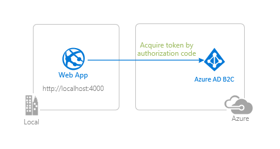

# A Node.js & Express web app authenticating users against Azure AD B2C with MSAL Node

 1. [Overview](#overview)
 1. [Scenario](#scenario)
 1. [Contents](#contents)
 1. [Prerequisites](#prerequisites)
 1. [Setup](#setup)
 1. [Registration](#registration)
 1. [Running the sample](#running-the-sample)
 1. [Explore the sample](#explore-the-sample)
 1. [About the code](#about-the-code)
 1. [More information](#more-information)
 1. [Community Help and Support](#community-help-and-support)
 1. [Contributing](#contributing)

## Overview

This sample demonstrates a Node.js & Express web application that authenticates users against Azure AD, with the help of [Microsoft Authentication Library for Node.js [PREVIEW]](https://aka.ms/msalnode) (MSAL Node [PREVIEW]). In doing so, it also illustrates various authentication concepts, such as [OpenID scopes](https://docs.microsoft.com/azure/active-directory/develop/v2-permissions-and-consent#openid-connect-scopes), [ID Tokens](https://docs.microsoft.com/azure/active-directory-b2c/openid-connect), [ID Token validation](https://docs.microsoft.com/azure/active-directory-b2c/openid-connect#validate-the-id-token), [user-flows](https://docs.microsoft.com/azure/active-directory-b2c/user-flow-overview) and more.

## Scenario

1. The client application uses **MSAL Node** to obtain an ID Token from **Azure AD B2C**.
2. The **ID Token** proves that the user has successfully authenticated against **Azure AD B2C**.



## Contents

| File/folder           | Description                                                   |
|-----------------------|---------------------------------------------------------------|
| `AppCreationScripts/` | Contains Powershell scripts to automate app registration.     |
| `ReadmeFiles/`        | List of changes to the sample.                                |
| `App/`                | Express application source folder.                            |
| `app.js`              | Application entry point.                                      |

## Prerequisites

- [Node.js](https://nodejs.org/en/download/) must be installed to run this sample.
- A modern web browser. This sample uses **ES6** conventions and will not run on **Internet Explorer**.
- [Visual Studio Code](https://code.visualstudio.com/download) is recommended for running and editing this sample.
- An **Azure AD B2C** tenant. For more information see: [How to get an Azure AD B2C tenant](https://docs.microsoft.com/azure/active-directory-b2c/tutorial-create-tenant)
- A user account in your **Azure AD B2C** tenant.

## Setup

### Step 1: Clone or download this repository

From your shell or command line:

```console
    git clone https://github.com/Azure-Samples/ms-identity-javascript-nodejs-tutorial.git
```

or download and extract the repository .zip file.

> :warning: To avoid path length limitations on Windows, we recommend cloning into a directory near the root of your drive.

### Step 2: Install project dependencies

Locate the root of the sample folder. Then:

```console
    npm install
```

## Registration

:warning: This sample comes with a pre-registered application for testing purposes. If you would like to use your own **Azure AD B2C** tenant and application, follow the steps below to register and configure the application in the **Azure portal**. Otherwise, continue with the steps for [Running the sample](#running-the-sample).

### Choose the Azure AD tenant where you want to create your applications

As a first step you'll need to:

1. Sign in to the [Azure portal](https://portal.azure.com).
1. If your account is present in more than one Azure AD B2C tenant, select your profile at the top right corner in the menu on top of the page, and then **switch directory** to change your portal session to the desired Azure AD B2C tenant.

### Create User Flows

Please refer to: [Tutorial: Create user flows in Azure Active Directory B2C](https://docs.microsoft.com/azure/active-directory-b2c/tutorial-create-user-flows)

### Add External Identity Providers

Please refer to: [Tutorial: Add identity providers to your applications in Azure Active Directory B2C](https://docs.microsoft.com/azure/active-directory-b2c/tutorial-add-identity-providers)

### Register the app

1. Navigate to the [Azure portal](https://portal.azure.com) and select the **Azure AD B2C** service.
1. Select the **App Registrations** blade on the left, then select **New registration**.
1. In the **Register an application page** that appears, enter your application's registration information:
   - In the **Name** section, enter a meaningful application name that will be displayed to users of the app, for example `WebAppB2C`.
   - Under **Supported account types**, select **Accounts in any organizational directory and personal Microsoft accounts (e.g. Skype, Xbox, Outlook.com)**.
   - In the **Redirect URI (optional)** section, select **Web** in the combo-box and enter the following redirect URI: `http://localhost:4000/redirect`.
1. Select **Register** to create the application.
1. In the app's registration screen, find and note the **Application (client) ID**. You use this value in your app's configuration file(s) later in your code.
1. Select **Save** to save your changes.
1. In the app's registration screen, select the **Certificates & secrets** blade in the left to open the page where we can generate secrets and upload certificates.
1. In the **Client secrets** section, select **New client secret**:
   - Type a key description (for instance `app secret`),
   - Select one of the available key durations (**In 1 year**, **In 2 years**, or **Never Expires**) as per your security posture.
   - The generated key value will be displayed when you select the **Add** button. Copy the generated value for use in the steps later.
   - You'll need this key later in your code's configuration files. This key value will not be displayed again, and is not retrievable by any other means, so make sure to note it from the Azure portal before navigating to any other screen or blade.

#### Configure the app to use your app registration

Open the project in your IDE (like Visual Studio or Visual Studio Code) to configure the code.

> In the steps below, "ClientID" is the same as "Application ID" or "AppId".

1. Open the `auth.json` file.
1. Find the key `ClientId` and replace the existing value with the application ID (clientId) of the application copied from **Azure Portal**.
1. Find the key `TenantId` and replace the existing value with your Azure AD tenant ID (or tenant name) copied from **Azure Portal**.
1. Find the key `ClientSecret` and replace the existing value with the key you saved during the creation of the application, on **Azure Portal**.
1. Find the key `homePageRoute` and replace the existing value with the home page route of your application, e.g. `/home`.
1. Find the key `redirectUri` and replace the existing value with the redirect URI that you have registered on **Azure Portal**, e.g. `http://localhost:4000/redirect`.
1. Find the key `postLogoutRedirectUri` and replace the existing value with the URI of the page that you wish to be redirected after signing-out, e.g `http://localhost:4000/`.
1. Find the key `policies.authorities` abd replace it with the authority strings of your policies/user-flows, e.g. `https://fabrikamb2c.b2clogin.com/fabrikamb2c.onmicrosoft.com/b2c_1_susi`.
1. Find the key `policies.authorityDomain` abd replace it with the domain of your authority, e.g. `fabrikamb2c.b2clogin.com`.

## Running the sample

Locate the root of the sample folder. Then:

```console
    npm start
```

## Explore the sample

1. Open your browser and navigate to `http://localhost:4000`.
1. Click the sign-in button on the top right corner.


> :information_source: Did the sample not work for you as expected? Then please reach out to us using the [GitHub Issues](../../../../issues) page.

## We'd love your feedback!

Were we successful in addressing your learning objective? Consider taking a moment to [share your experience with us](https://forms.office.com/Pages/ResponsePage.aspx?id=v4j5cvGGr0GRqy180BHbR73pcsbpbxNJuZCMKN0lURpUQkRCSVdRSk8wUjdZSkg2NEZGOFFaTkxQVyQlQCN0PWcu).

## About the code

## Initialization

`MsalNodeWrapper` class is initialized in the [routes/router.js](./App/routes/router.js). It expects two parameters, a JSON configuration object (see [auth.json](./auth.json)), and an optional cache plug-in (see [cachePlugin.js](./App/utils/cachePlugin.js)) if you wish to save your cache to disk. Otherwise, in-memory only cache is used.

Once initialized, `MsalNodeWrapper` middleware can be used in routes:

```javascript
    const express = require('express');

    const msal = new MsalNodeWrapper(config, cache);

    // initialize router
    const router = express.Router();

    router.get('/signin', msal.signIn);
    router.get('/signout', msal.signOut);
    router.get('/redirect', msal.handleRedirect);
```

Under the hood, the wrapper creates an **MSAL Node** [configuration object](https://github.com/AzureAD/microsoft-authentication-library-for-js/blob/dev/lib/msal-node/docs/configuration.md) and initializes [msal.ConfidentialClientApplication](https://github.com/AzureAD/microsoft-authentication-library-for-js/blob/dev/lib/msal-node/src/client/ConfidentialClientApplication.ts) by passing it.

```javascript
    constructor(config, cache = null) {
        MsalNodeWrapper.validateConfiguration(config);
        
        this.rawConfig = config;
        this.msalConfig = MsalNodeWrapper.shapeConfiguration(config, cache);
        this.msalClient = new msal.ConfidentialClientApplication(this.msalConfig);
    };
```

### Sign-in

The user clicks on the **sign-in** button and routes to `/signin`. `msal.signIn` middleware takes over. First it creates session variables:

```javascript
        signIn = (req, res, next) => {     

        if (!req.session['authCodeRequest']) {
            req.session.authCodeRequest = {
                authority: "",
                scopes: [],
                state: {},
                redirectUri: ""
            };
        }

        if (!req.session['tokenRequest']) {
            req.session.tokenRequest = {
                authority: "",
                scopes: [],
                state: {},
                redirectUri: ""
            };
        }

        // current account id
        req.session.homeAccountId = "";
```

Then, creates and encodes a state object to pass with an authorization code request. The object is passed to the `state` parameter as a means of controlling the application flow. For more information, see [Pass custom state in authentication requests using MSAL.js](https://docs.microsoft.com/azure/active-directory/develop/msal-js-pass-custom-state-authentication-request).

```javascript
      // sign-in as usual
      let state = CryptoUtilities.base64EncodeUrl(
        JSON.stringify({
            stage: constants.AppStages.SIGN_IN,
            path: req.route.path,
            nonce: req.session.nonce
        }));

      // get url to sign user in (and consent to scopes needed for application)
      this.getAuthCode(
          this.msalConfig.auth.authority, 
          Object.values(constants.OIDCScopes), // pass standard openid scopes as permissions
          state, 
          this.msalConfig.auth.redirectUri,
          req, // express request object
          res // express response object
      );
```

Under the hood, `getAuthCode()` assigns request parameters to session, and calls the **MSAL Node** `getAuthCodeUrl()` API

```javascript
    const response = await this.msalClient.getAuthCodeUrl(req.session.authCodeRequest);
```

### Get a token

After making an authorization code URL request, the user is redirected to the redirect route defined in the **Azure AD B2C** app registration. Once redirected, the `handleRedirect` middleware takes over. It first checks for `nonce` parameter in state against *cross-site resource forgery* (csrf) attacks, and then for the current app stage. Then, using the `code` in query parameters, tokens are requested using the **MSAL Node** `acquireTokenByCode()` API, and the response is appended to the *express-session** variable.

```javascript
    handleRedirect = async(req, res, next) => {
        //...

        if (state.nonce === req.session.nonce) {
            if (state.stage === constants.AppStages.SIGN_IN) {
        
                // token request should have auth code
                const tokenRequest = {
                    redirectUri: this.msalConfig.auth.redirectUri,
                    scopes: Object.keys(constants.OIDCScopes),
                    code: req.query.code,
                };
        
                try {
                    // exchange auth code for tokens
                    const tokenResponse = await this.msalClient.acquireTokenByCode(tokenRequest)
                    console.log("\nResponse: \n:", tokenResponse);
        
                    if (this.validateIdToken(tokenResponse.idTokenClaims)) {
                                
                        req.session.homeAccountId = tokenResponse.account.homeAccountId;
        
                        // assign session variables
                        req.session.idTokenClaims = tokenResponse.idTokenClaims;
                        req.session.isAuthenticated = true;
        
                        return res.status(200).redirect(this.rawConfig.configuration.homePageRoute);
                    } else {
                        console.log('invalid token');
                        return res.status(401).send("Not Permitted");
                }

            //...
    }
```

### ID token validation

Web apps (and confidential client apps in general) should validate ID Tokens. **MSAL Node** decodes the ID token. In `MsalNodeWrapper`, we add the ID token to session, and then validate it:

```javascript
    const checkAudience = idTokenClaims["aud"] === this.msalConfig.auth.clientId ? true : false;
    const checkTimestamp = idTokenClaims["iat"] <= now && idTokenClaims["exp"] >= now ? true : false;
    const checkTenant = (this.rawConfig.hasOwnProperty('policies') && !idTokenClaims["tid"]) || idTokenClaims["tid"] === this.rawConfig.credentials.tenantId ? true : false;

    return checkAudience && checkTimestamp && checkTenant;
```

ID token validation should be validated according to the guide [ID Token validation](https://docs.microsoft.com/azure/active-directory-b2c/tokens-overview#validation). Implementation can vary, and it is the app developers responsibility.

### Sign-out

We construct a logout URL following the [guide here](https://docs.microsoft.com/azure/active-directory-b2c/openid-connect#send-a-sign-out-request). Then, we destroy the current **express-session** and redirect the user to **sign-out endpoint**.

```javascript
    signOut = (req, res, next) => {
        const logoutURI = '<your-tenanted-logout-url>';

        req.session.isAuthenticated = false;
        
        req.session.destroy(() => {
            res.redirect(logoutURI);
        });
    };
```

### User flows

Implementing **B2C user-flows** is a matter of initiating authorization requests against the corresponding authorities. Some user-flows are slightly more complex. For example, to initiate `resetPassword`, the user first first needs to click on the **forgot my password** link on the **Azure sign-in screen**, which causes B2C service to respond with an error. We then catch this error, and trigger another sign-in, this time against the `resetPassword` authority defined in [auth.json](./auth.json).

```javascript
    handleRedirect = async(req, res, next) => {
        //...
        if (state.nonce === req.session.nonce) {
            if (state.stage === constants.AppStages.SIGN_IN) {
                //...
                try {
                    //...
                } catch (error) {
                    console.log(error);

                    if (req.query.error) {
                        if (JSON.stringify(req.query.error_description).includes("AADB2C90118")) {

                            req.session.nonce = CryptoUtilities.generateGuid();

                            let newState = CryptoUtilities.base64EncodeUrl(
                                JSON.stringify({
                                    stage: constants.AppStages.RESET_PASSWORD,
                                    path: req.route.path,
                                    nonce: req.session.nonce
                                }));

                            req.session.authCodeRequest.state = newState;
                            req.session.authCodeRequest.authority = this.rawConfig.policies.resetPassword.authority;

                            // redirect to sign in page again with resetPassword authority
                            return res.redirect(state.path);
                        } 
                    }
                    res.status(500).send(error);
                }
            //...
    }
```

For more information, visit [user-flow-overview](https://docs.microsoft.com/azure/active-directory-b2c/user-flow-overview#linking-user-flows).

## More information

- [What is Azure Active Directory B2C?](https://docs.microsoft.com/azure/active-directory-b2c/overview)
- [Application types that can be used in Active Directory B2C](https://docs.microsoft.com/azure/active-directory-b2c/application-types)
- [Recommendations and best practices for Azure Active Directory B2C](https://docs.microsoft.com/azure/active-directory-b2c/best-practices)
- [Azure AD B2C session](https://docs.microsoft.com/azure/active-directory-b2c/session-overview)
- [Initialize client applications using MSAL.js](https://docs.microsoft.com/azure/active-directory/develop/msal-js-initializing-client-applications)
- [Single sign-on with MSAL.js](https://docs.microsoft.com/azure/active-directory/develop/msal-js-sso)
- [Handle MSAL.js exceptions and errors](https://docs.microsoft.com/azure/active-directory/develop/msal-handling-exceptions?tabs=javascript)
- [Logging in MSAL.js applications](https://docs.microsoft.com/azure/active-directory/develop/msal-logging?tabs=javascript)
- [Pass custom state in authentication requests using MSAL.js](https://docs.microsoft.com/azure/active-directory/develop/msal-js-pass-custom-state-authentication-request)
- [Prompt behavior in MSAL.js interactive requests](https://docs.microsoft.com/azure/active-directory/develop/msal-js-prompt-behavior)
- [Use MSAL.js to work with Azure AD B2C](https://docs.microsoft.com/azure/active-directory/develop/msal-b2c-overview)

For more information about how OAuth 2.0 protocols work in this scenario and other scenarios, see [Authentication Scenarios for Azure AD](https://docs.microsoft.com/azure/active-directory/develop/authentication-flows-app-scenarios).

## Community Help and Support

Use [Stack Overflow](http://stackoverflow.com/questions/tagged/msal) to get support from the community.
Ask your questions on Stack Overflow first and browse existing issues to see if someone has asked your question before.
Make sure that your questions or comments are tagged with [`azure-active-directory` `azure-ad-b2c` `ms-identity` `adal` `msal`].

If you find a bug in the sample, raise the issue on [GitHub Issues](../../issues).

To provide feedback on or suggest features for Azure Active Directory, visit [User Voice page](https://feedback.azure.com/forums/169401-azure-active-directory).

## Contributing

If you'd like to contribute to this sample, see [CONTRIBUTING.MD](/CONTRIBUTING.md).

This project has adopted the [Microsoft Open Source Code of Conduct](https://opensource.microsoft.com/codeofconduct/). For more information, see the [Code of Conduct FAQ](https://opensource.microsoft.com/codeofconduct/faq/) or contact [opencode@microsoft.com](mailto:opencode@microsoft.com) with any additional questions or comments.