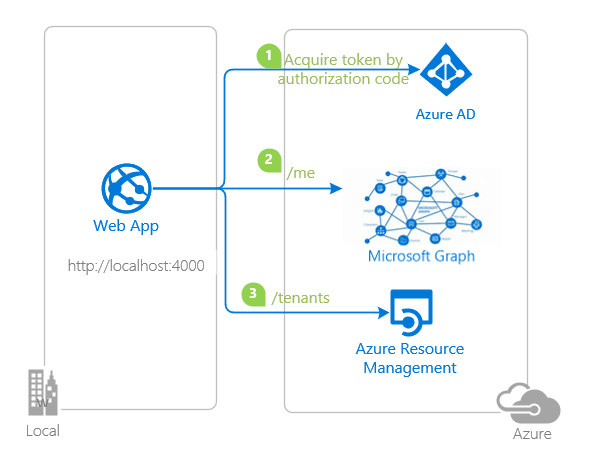
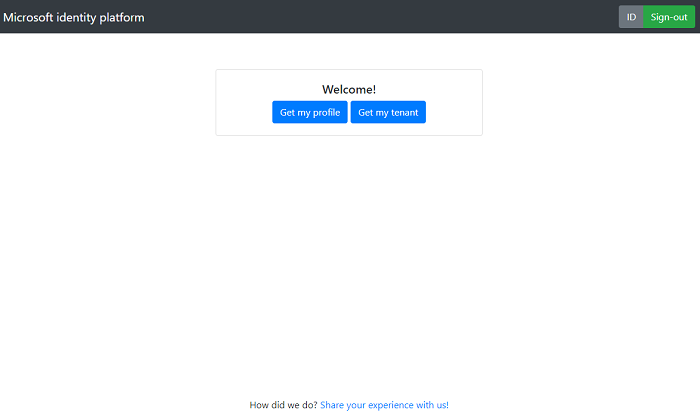

# A Node.js & Express Web App calling Microsoft Graph using MSAL Node

 1. [Overview](#overview)
 1. [Scenario](#scenario)
 1. [Contents](#contents)
 1. [Prerequisites](#prerequisites)
 1. [Setup](#setup)
 1. [Registration](#registration)
 1. [Running the sample](#running-the-sample)
 1. [Explore the sample](#explore-the-sample)
 1. [About the code](#about-the-code)
 1. [More information](#more-information)
 1. [Community Help and Support](#community-help-and-support)
 1. [Contributing](#contributing)

## Overview

This sample demonstrates a Node.js & Express web application that authenticates users against [Azure Active Directory](https://docs.microsoft.com/azure/active-directory/fundamentals/active-directory-whatis) (Azure AD) and obtains [Access Tokens](https://docs.microsoft.com/azure/active-directory/develop/access-tokens) to call [Microsoft Graph API](https://docs.microsoft.com/graph/overview) (Graph API) and [Azure Resource Manager API](https://docs.microsoft.com/azure/azure-resource-manager/management/overview) (ARM API), with the help of [Microsoft Authentication Library for Node.js](https://aka.ms/msalnode) (MSAL Node). In doing so, it also illustrates various authorization concepts, such as [OAuth 2.0 Authorization Code Grant](https://docs.microsoft.com/azure/active-directory/develop/v2-oauth2-auth-code-flow), [Dynamic Scopes and Incremental Consent](https://docs.microsoft.com/azure/active-directory/develop/v2-permissions-and-consent), **working with multiple resources** and more.

## Scenario

1. The client application uses the **MSAL Node** to sign-in a user and obtain a JWT **Access Token** from **Azure AD**.
1. The **Access Token** is used as a *bearer* token to authorize the user to access the **resource** (Graph API or ARM API).
1. The **resource owner** responds with the resource that the user has access to.



## Contents

| File/folder           | Description                                                   |
|-----------------------|---------------------------------------------------------------|
| `AppCreationScripts/` | Contains Powershell scripts to automate app registration.     |
| `ReadmeFiles/`        | List of changes to the sample.                                |
| `App/`                | Express application source folder.                            |
| `App/utils`           | Contains msal-node helper classes.                            |
| `app.js`              | Application entry point.                                      |
| `App/routes/router.js`| Controllers and msal-node helper middleware.                  |

## Prerequisites

- [Node.js](https://nodejs.org/en/download/) must be installed to run this sample.
- A modern web browser. This sample uses **ES6** conventions and will not run on **Internet Explorer**.
- [Visual Studio Code](https://code.visualstudio.com/download) is recommended for running and editing this sample.
- An **Azure AD** tenant. For more information, see: [How to get an Azure AD tenant](https://docs.microsoft.com/azure/active-directory/develop/quickstart-create-new-tenant)
- A user account in your **Azure AD** tenant. This sample will not work with a **personal Microsoft account**. Therefore, if you signed in to the [Azure portal](https://portal.azure.com) with a personal account and have never created a user account in your directory before, you need to do that now.

## Setup

### Step 1: Clone or download this repository

From your shell or command line:

```console
    git clone https://github.com/Azure-Samples/ms-identity-javascript-nodejs-tutorial.git
```

or download and extract the repository .zip file.

> :warning: To avoid path length limitations on Windows, we recommend cloning into a directory near the root of your drive.

### Step 2: Install project dependencies

Locate the root of the sample folder. Then:

```console
    npm install
```

## Registration

There is one project in this sample. To register it, you can:

- follow the steps below for manually register your apps
- or use PowerShell scripts that:
  - **automatically** creates the Azure AD applications and related objects (passwords, permissions, dependencies) for you.
  - modify the projects' configuration files.

<details>
  <summary>Expand this section if you want to use this automation:</summary>

> :warning: If you have never used **Azure AD Powershell** before, we recommend you go through the [App Creation Scripts](./AppCreationScripts/AppCreationScripts.md) once to ensure that your environment is prepared correctly for this step.

1. On Windows, run PowerShell as **Administrator** and navigate to the root of the cloned directory
1. If you have never used Azure AD Powershell before, we recommend you go through the [App Creation Scripts](./AppCreationScripts/AppCreationScripts.md) once to ensure that your environment is prepared correctly for this step.
1. In PowerShell run:

   ```PowerShell
   Set-ExecutionPolicy -ExecutionPolicy RemoteSigned -Scope Process -Force
   ```

1. Run the script to create your Azure AD application and configure the code of the sample application accordingly.
1. In PowerShell run:

   ```PowerShell
   cd .\AppCreationScripts\
   .\Configure.ps1
   ```

   > Other ways of running the scripts are described in [App Creation Scripts](./AppCreationScripts/AppCreationScripts.md)
   > The scripts also provide a guide to automated application registration, configuration and removal which can help in your CI/CD scenarios.

</details>

### Choose the Azure AD tenant where you want to create your applications

As a first step you'll need to:

1. Sign in to the [Azure portal](https://portal.azure.com).
1. If your account is present in more than one Azure AD tenant, select your profile at the top right corner in the menu on top of the page, and then **switch directory** to change your portal session to the desired Azure AD tenant.

### Register the web app

1. Navigate to the [Azure portal](https://portal.azure.com) and select the **Azure AD** service.
1. Select the **App Registrations** blade on the left, then select **New registration**.
1. In the **Register an application page** that appears, enter your application's registration information:
   - In the **Name** section, enter a meaningful application name that will be displayed to users of the app, for example `ExpressWebApp`.
   - Under **Supported account types**, select **Accounts in this organizational directory only**.
   - In the **Redirect URI (optional)** section, select **Web** in the combo-box and enter the following redirect URI: `http://localhost:4000/redirect`.
1. Select **Register** to create the application.
1. In the app's registration screen, find and note the **Application (client) ID**. You use this value in your app's configuration file(s) later in your code.
1. Select **Save** to save your changes.
1. In the app's registration screen, select the **Certificates & secrets** blade in the left to open the page where we can generate secrets and upload certificates.
1. In the **Client secrets** section, select **New client secret**:
   - Type a key description (for instance `app secret`),
   - Select one of the available key durations (**In 1 year**, **In 2 years**, or **Never Expires**) as per your security posture.
   - The generated key value will be displayed when you select the **Add** button. Copy the generated value for use in the steps later.
   - You'll need this key later in your code's configuration files. This key value will not be displayed again, and is not retrievable by any other means, so make sure to note it from the Azure portal before navigating to any other screen or blade.
1. In the app's registration screen, select the **API permissions** blade in the left to open the page where we add access to the APIs that your application needs.
   - Select the **Add a permission** button and then,
   - Ensure that the **Microsoft APIs** tab is selected.
   - In the *Commonly used Microsoft APIs* section, select **Microsoft Graph**
   - In the **Delegated permissions** section, select the **User.Read** in the list. Use the search box if necessary.
   - Select the **Add permissions** button at the bottom.
1. Still in the **API permissions** blade,
   - Select the **Add a permission** button and then,
   - Ensure that the **Microsoft APIs** tab is selected.
   - In the *Commonly used Microsoft APIs* section, select **Azure Service Management**
   - In the **Delegated permissions** section, select the **user_impersonation** in the list. Use the search box if necessary.
   - Select the **Add permissions** button at the bottom.

#### Configure the web app to use your app registration

Open the project in your IDE (like Visual Studio or Visual Studio Code) to configure the code.

> In the steps below, "ClientID" is the same as "Application ID" or "AppId".

1. Open the `auth.json` file.
1. Find the key `clientId` and replace the existing value with the **application ID** (clientId) of the `ExpressWebApp` application copied from the Azure Portal.
1. Find the key `tenantId` and replace the existing value with your Azure AD **tenant ID**.
1. Find the key `clientSecret` and replace the existing value with the key you saved during the creation of the `ExpressWebApp` app, in the Azure Portal.
1. Find the key `homePageRoute` and replace the existing value with the route that you wish to be redirected after sign-in, e.g. `/home`.
1. Find the key `redirectUri` and replace the existing value with the **Redirect URI** for `ExpressWebApp` app. For example, `http://localhost:4000/redirect`.
1. Find the `postLogoutRedirectUri` and replace the existing value with the URI that you wish to be redirected after sign-out, e.g. `http://localhost:4000/`

The rest of the **key-value** pairs are for resources/APIs that you would like to call. They are set as **default**, but you can modify them as you wish:

```json
        "nameOfYourResource": {
            "callingPageRoute": "/<route_where_this_resource_will_be_called_from>",
            "endpoint": "<uri_coordinates_of_the_resource>",
            "scopes": ["scope1_of_the_resource", "scope1_of_the_resource", "..."]
        },
```

## Running the sample

Locate the root of the sample folder. Then:

```console
    npm start
```

## Explore the sample

1. Open your browser and navigate to `http://localhost:4000`.
1. Click the **Sign-in** button on the top right corner.
1. Once you sign-in, click on the **See my profile** button to call **Microsoft Graph**.
1. Once you sign-in, click on the **Get my tenant** button to call **Azure Resource Manager**.



> :information_source: Did the sample not work for you as expected? Then please reach out to us using the [GitHub Issues](../../../../issues) page.

## We'd love your feedback!

Were we successful in addressing your learning objective? Consider taking a moment to [share your experience with us](https://forms.office.com/Pages/ResponsePage.aspx?id=v4j5cvGGr0GRqy180BHbR73pcsbpbxNJuZCMKN0lURpUQkRCSVdRSk8wUjdZSkg2NEZGOFFaTkxQVyQlQCN0PWcu).

## About the code

### Configuration

### Protected resources and scopes

In order to access a protected resource on behalf of a signed-in user, the app needs to present a valid **Access Token** to that resource owner (for example, Microsoft Graph). The intended recipient of an **Access Token** is represented by the `aud` claim (in this case, it should be the Microsoft Graph API's App ID); in case the value for the `aud` claim does not mach the resource **APP ID URI**, the token should be considered invalid. Likewise, the permissions that an **Access Token** grants is represented by the `scp` claim. See [Access Token claims](https://docs.microsoft.com/azure/active-directory/develop/access-tokens#payload-claims) for more information.

Scopes can come in various forms so it pays off to be familiar with them. The following are all resource scopes:

- `user.read` - short-hand expression for Microsoft Graph **User** resource scope
- `https://management.azure.com/user_impersonation` - https expression of a multi-tenant resource scope
- `api://9k8521c1-bab5-1256-a87b-574f83c463z6/access_as_user` - expression of a single-tenant resource (e.g. custom web API) scope

### Dynamic scopes and incremental consent


In the code snippet above, the user will be prompted for consent once they authenticate and receive an **ID Token** and an **Access Token** with scope `User.Read`. Later, if they request an **Access Token** for `User.Read`, they will not be asked for consent again (in other words, they can acquire a token *silently*). On the other hand, the user did not consented to `Mail.Read` at the authentication stage. As such, they will be asked for consent when requesting an **Access Token** for that scope. The token received will contain all the previously consented scopes, hence the term *incremental consent*.

### Working with multiple resources

When you have to access different resources (for instance, Microsoft Graph API *and* Azure Resource Manager API), initiate a separate token request for each:

Bear in mind that you can request multiple scopes for the same resource (e.g. `User.Read`, `User.Write` and `Calendar.Read` for Graph API).


In case you erroneously pass multiple resources in your token request, the token you will receive will only be issued for the first resource.


### Access Token validation

Clients should treat access tokens as opaque strings, as the contents of the token are intended for the **resource only** (such as a web API or Microsoft Graph). For validation and debugging purposes, developers can decode **JWT**s (*JSON Web Tokens*) using a site like [jwt.ms](https://jwt.ms).

## More information

Configure your application:

- [Initialize client applications using MSAL.js](https://docs.microsoft.com/azure/active-directory/develop/msal-js-initializing-client-applications)
- [Single sign-on with MSAL.js](https://docs.microsoft.com/azure/active-directory/develop/msal-js-sso)
- [Handle MSAL.js exceptions and errors](https://docs.microsoft.com/azure/active-directory/develop/msal-handling-exceptions?tabs=javascript)
- [Logging in MSAL.js applications](https://docs.microsoft.com/azure/active-directory/develop/msal-logging?tabs=javascript)
- [Pass custom state in authentication requests using MSAL.js](https://docs.microsoft.com/azure/active-directory/develop/msal-js-pass-custom-state-authentication-request)
- [Prompt behavior in MSAL.js interactive requests](https://docs.microsoft.com/azure/active-directory/develop/msal-js-prompt-behavior)

Learn more about the Microsoft identity platform:

- [Microsoft identity platform (Azure Active Directory for developers)](https://docs.microsoft.com/azure/active-directory/develop/)
- [Overview of Microsoft Authentication Library (MSAL)](https://docs.microsoft.com/azure/active-directory/develop/msal-overview)
- [Understanding Azure AD application consent experiences](https://docs.microsoft.com/azure/active-directory/develop/application-consent-experience)
- [Understand user and admin consent](https://docs.microsoft.com/azure/active-directory/develop/howto-convert-app-to-be-multi-tenant#understand-user-and-admin-consent)
- [Microsoft identity platform and OpenID Connect protocol](https://docs.microsoft.com/azure/active-directory/develop/v2-protocols-oidc)
- [Microsoft Identity Platform ID Tokens](https://docs.microsoft.com/azure/active-directory/develop/id-tokens)

For more information about how OAuth 2.0 protocols work in this scenario and other scenarios, see [Authentication Scenarios for Azure AD](https://docs.microsoft.com/azure/active-directory/develop/authentication-flows-app-scenarios).

## Community Help and Support

Use [Stack Overflow](http://stackoverflow.com/questions/tagged/msal) to get support from the community.
Ask your questions on Stack Overflow first and browse existing issues to see if someone has asked your question before.
Make sure that your questions or comments are tagged with [`azure-active-directory` `azure-ad-b2c` `ms-identity` `adal` `msal`].

If you find a bug in the sample, raise the issue on [GitHub Issues](../../issues).

To provide feedback on or suggest features for Azure Active Directory, visit [User Voice page](https://feedback.azure.com/forums/169401-azure-active-directory).

## Contributing

If you'd like to contribute to this sample, see [CONTRIBUTING.MD](/CONTRIBUTING.md).

This project has adopted the [Microsoft Open Source Code of Conduct](https://opensource.microsoft.com/codeofconduct/). For more information, see the [Code of Conduct FAQ](https://opensource.microsoft.com/codeofconduct/faq/) or contact [opencode@microsoft.com](mailto:opencode@microsoft.com) with any additional questions or comments.