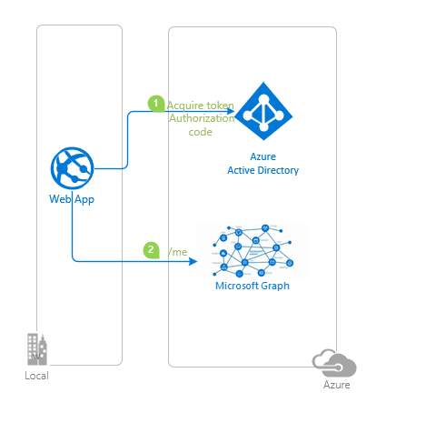

# A Node.js & Express web app authenticating users against Azure AD with MSAL Node and passport custom strategy to call Graph API

* [Overview](#overview)
* [Scenario](#scenario)
* [Contents](#contents)
* [Prerequisites](#prerequisites)
* [Setup the sample](#setup-the-sample)
* [Explore the sample](#explore-the-sample)
* [Troubleshooting](#troubleshooting)
* [About the code](#about-the-code)
* [Next Steps](#next-steps)
* [Contributing](#contributing)
* [Learn More](#learn-more)

## Overview

This sample demonstrates a Node.js & Express web app authenticating users against Azure Active Directory (Azure AD) with [Microsoft Authentication Library for Node (MSAL Node)](https://github.com/AzureAD/microsoft-authentication-library-for-js?fbclid=IwAR0F-rtrVjHuv6fBiSrX6czZU7mrIcwn6I7iAsuQ9ZvP85xTFd0PSyRgtzE) and [passport custom strategy](https://www.passportjs.org/packages/passport-custom/) to call Graph API.

## Scenario

1. The client Node.js & Express web app uses the  to sign-in a user and obtain a JWT [ID Token](https://aka.ms/id-tokens) and an [Access Token](https://aka.ms/access-tokens) from **Azure AD**.
1. The **access token** is used as a *bearer* token to authorize the user to call the Microsoft Graph protected by **Azure AD**.



## Contents

| File/folder                 | Description                                                   |
|-----------------------------|---------------------------------------------------------------|
| `AppCreationScripts/`       | Contains Powershell scripts to automate app registration.     |
| `App/authConfig.js`        | Authentication parameters and settings.                        |
| `App/app.js`                | Application entry point.                                      |
| `App/utils/graphClient.js` | Handles calls to Microsoft Graph using Graph JS SDK.           |
| `App/auth/AuthProvider.js`  | Main authentication logic resides here.                       |

## Prerequisites

* [Node.js](https://nodejs.org/en/download/) must be installed to run this sample.
* [Visual Studio Code](https://code.visualstudio.com/download) is recommended for running and editing this sample.
* [VS Code Azure Tools](https://marketplace.visualstudio.com/items?itemName=ms-vscode.vscode-node-azure-pack) extension is recommended for interacting with Azure through VS Code Interface.
* A modern web browser.
* An **Azure AD** tenant. For more information, see: [How to get an Azure AD tenant](https://docs.microsoft.com/azure/active-directory/develop/test-setup-environment#get-a-test-tenant)
* A user account in your **Azure AD** tenant.

>This sample will not work with a **personal Microsoft account**. If you're signed in to the [Azure portal](https://portal.azure.com) with a personal Microsoft account and have not created a user account in your directory before, you will need to create one before proceeding.

## Setup the sample

### Step 1: Clone or download this repository

From your shell or command line:

```console
git clone https://github.com/Azure-Samples/ms-identity-javascript-nodejs-tutorial.git
```

or download and extract the repository *.zip* file.

> :warning: To avoid path length limitations on Windows, we recommend cloning into a directory near the root of your drive.

### Step 2: Install project dependencies

```console
    cd 2-Authorization\4-call-api-express\APP
    npm install
```

### Step 3: Register the sample application(s) in your tenant

There is one project in this sample. To register it, you can:

* follow the steps below for manually register your apps
* or use PowerShell scripts that:
  * **automatically** creates the Azure AD applications and related objects (passwords, permissions, dependencies) for you.
  * modify the projects' configuration files.

<details>
   <summary>Expand this section if you want to use this automation:</summary>

> :warning: If you have never used **Microsoft Graph PowerShell** before, we recommend you go through the [App Creation Scripts Guide](./AppCreationScripts/AppCreationScripts.md) once to ensure that your environment is prepared correctly for this step.

1. Ensure that you have PowerShell 7 or later which can be installed at [this link](https://learn.microsoft.com/powershell/scripting/install/installing-powershell-on-windows?view=powershell-7.3).
1. Run the script to create your Azure AD application and configure the code of the sample application accordingly.
1. For interactive process -in PowerShell, run:

    ```PowerShell
    cd .\AppCreationScripts\
    .\Configure.ps1 -TenantId "[Optional] - your tenant id" -AzureEnvironmentName "[Optional] - Azure environment, defaults to 'Global'"
    ```

> Other ways of running the scripts are described in [App Creation Scripts guide](./AppCreationScripts/AppCreationScripts.md). The scripts also provide a guide to automated application registration, configuration and removal which can help in your CI/CD scenarios.

> :information_source: This sample can make use of client certificates. You can use **AppCreationScripts** to register an Azure AD application with certificates. See: [How to use certificates instead of client secrets](./README-use-certificate.md)

</details>

#### Choose the Azure AD tenant where you want to create your applications

To manually register the apps, as a first step you'll need to:

1. Sign in to the [Azure portal](https://portal.azure.com).
1. If your account is present in more than one Azure AD tenant, select your profile at the top right corner in the menu on top of the page, and then **switch directory** to change your portal session to the desired Azure AD tenant.

#### Register the client app (msal-node-webapp)

1. Navigate to the [Azure portal](https://portal.azure.com) and select the **Azure Active Directory** service.
1. Select the **App Registrations** blade on the left, then select **New registration**.
1. In the **Register an application page** that appears, enter your application's registration information:
    1. In the **Name** section, enter a meaningful application name that will be displayed to users of the app, for example `msal-node-webapp`.
    1. Under **Supported account types**, select **Accounts in this organizational directory only**
    1. Select **Register** to create the application.
1. In the **Overview** blade, find and note the **Application (client) ID**. You use this value in your app's configuration file(s) later in your code.
1. In the app's registration screen, select the **Authentication** blade to the left.
1. If you don't have a platform added, select **Add a platform** and select the **Web** option.
    1. In the **Redirect URI** section enter the following redirect URIs:
        1. `http://localhost:3000`
        1. `http://localhost:3000/auth/redirect`
    1. Click **Save** to save your changes.
1. In the app's registration screen, select the **Certificates & secrets** blade in the left to open the page where you can generate secrets and upload certificates.
1. In the **Client secrets** section, select **New client secret**:
    1. Type a key description (for instance `app secret`).
    1. Select one of the available key durations (**6 months**, **12 months** or **Custom**) as per your security posture.
    1. The generated key value will be displayed when you select the **Add** button. Copy and save the generated value for use in later steps.
    1. You'll need this key later in your code's configuration files. This key value will not be displayed again, and is not retrievable by any other means, so make sure to note it from the Azure portal before navigating to any other screen or blade.
    > :warning: For enhanced security, consider using **certificates** instead of client secrets. See: [How to use certificates instead of secrets](./README-use-certificate.md).
1. Since this app signs-in users, we will now proceed to select **delegated permissions**, which is is required by apps signing-in users.
    1. In the app's registration screen, select the **API permissions** blade in the left to open the page where we add access to the APIs that your application needs:
    1. Select the **Add a permission** button and then:
    1. Ensure that the **Microsoft APIs** tab is selected.
    1. In the *Commonly used Microsoft APIs* section, select **Microsoft Graph**
    1. In the **Delegated permissions** section, select **User.Read** in the list. Use the search box if necessary.
    1. Select the **Add permissions** button at the bottom.

##### Configure the client app (msal-node-webapp) to use your app registration

Open the project in your IDE (like Visual Studio or Visual Studio Code) to configure the code.

> In the steps below, "ClientID" is the same as "Application ID" or "AppId".

1. Open the `APP\authConfig.js` file.
1. Find the key `Enter_the_Application_Id_Here` and replace the existing value with the application ID (clientId) of `msal-node-webapp` app copied from the Azure portal.
1. Find the key `Enter_the_Tenant_Info_Here` and replace the existing value with your Azure AD tenant/directory ID.
1. Find the key `Enter_the_Client_Secret_Here` and replace the existing value with the generated secret that you saved during the creation of `msal-node-webapp` copied from the Azure portal.

### Step 4: Running the sample

```console
    cd 2-Authorization\4-call-api-express\APP
    npm start
```

## Explore the sample

1. Open your browser and navigate to `http://localhost:3000`.
1. Select the **Sign In** link on the page.
1. Select the **Profile** link on the page. This will make a call to the ToDoList web API.


> :information_source: Did the sample not work for you as expected? Then please reach out to us using the [GitHub Issues](../../../../issues) page.

## We'd love your feedback!

Were we successful in addressing your learning objective? Consider taking a moment to [share your experience with us]([Enter_Survey_Form_Link](https://forms.office.com/Pages/ResponsePage.aspx?id=v4j5cvGGr0GRqy180BHbR_ivMYEeUKlEq8CxnMPgdNZUNDlUTTk2NVNYQkZSSjdaTk5KT1o4V1VVNS4u)).

## Troubleshooting

<details>
	<summary>Expand for troubleshooting info</summary>

> * Use [Stack Overflow](http://stackoverflow.com/questions/tagged/msal) to get support from the community. Ask your questions on Stack Overflow first and browse existing issues to see if someone has asked your question before.
Ask your questions on Stack Overflow first and browse existing issues to see if someone has asked your question before.
Make sure that your questions or comments are tagged with [`azure-active-directory-b2c` `node` `ms-identity` `adal` `msal-js` `msal`].

To provide feedback on or suggest features for Azure Active Directory, visit [User Voice page](https://feedback.azure.com/d365community/forum/79b1327d-d925-ec11-b6e6-000d3a4f06a4).
</details>

## About the code

### Sign-in

The user clicks on the **sign-in** and routes to `auth/login`. From there, the [login()](../App/auth/AuthProvider.js) method in the `AuthProvider.js` takes over. It creates and encodes a state object to pass with an authorization code request. The object is passed to the `state` parameter as a means of controlling the application flow. For more information, see [Pass custom state in authentication requests using MSAL](https://docs.microsoft.com/azure/active-directory/develop/msal-js-pass-custom-state-authentication-request).

```javascript
async login(req, res, next, options = {}) {
        // create a GUID for crsf
        req.session.csrfToken = this.cryptoProvider.createNewGuid();

        /**
         * The MSAL Node library allows you to pass your custom state as state parameter in the Request object.
         * The state parameter can also be used to encode information of the app's state before redirect.
         * You can pass the user's state in the app, such as the page or view they were on, as input to this parameter.
         */

        const state = this.cryptoProvider.base64Encode(
            JSON.stringify({
                csrfToken: req.session.csrfToken,
                redirectTo: '/',
            })
        );

        const authCodeUrlRequestParams = {
            state: state,

            /**
             * By default, MSAL Node will add OIDC scopes to the auth code url request. For more information, visit:
             * https://docs.microsoft.com/azure/active-directory/develop/v2-permissions-and-consent#openid-connect-scopes
             */
            scopes: [],
        };

        const authCodeRequestParams = {
            state: state,

            /**
             * By default, MSAL Node will add OIDC scopes to the auth code request. For more information, visit:
             * https://docs.microsoft.com/azure/active-directory/develop/v2-permissions-and-consent#openid-connect-scopes
             */
            scopes: [],
        };

        /**
         * If the current msal configuration does not have cloudDiscoveryMetadata or authorityMetadata, we will
         * make a request to the relevant endpoints to retrieve the metadata. This allows MSAL to avoid making
         * metadata discovery calls, thereby improving performance of token acquisition process.
         */

        if (!this.config.msalConfig.auth.cloudDiscoveryMetadata || !this.config.msalConfig.auth.authorityMetadata) {
            const [cloudDiscoveryMetadata, authorityMetadata] = await Promise.all([
                this.getCloudDiscoveryMetadata(),
                this.getAuthorityMetadata(),
            ]);

            this.config.msalConfig.auth.cloudDiscoveryMetadata = JSON.stringify(cloudDiscoveryMetadata);
            this.config.msalConfig.auth.authorityMetadata = JSON.stringify(authorityMetadata);
        }

        const msalInstance = this.getMsalInstance(this.config.msalConfig);

        // trigger the first leg of auth code flow
        return this.redirectToAuthCodeUrl(
            req,
            res,
            next,
            authCodeUrlRequestParams,
            authCodeRequestParams,
            msalInstance
        );
    }
```

The `redirectToAuthCodeUrl()` method assigns request parameters and calls the **MSAL Node**'s [getAuthCodeUrl()](https://azure-samples.github.io/microsoft-identity-express/classes/MsalWebAppAuthClient.html#getAuthCodeUrl) API. It then redirects the app to auth code URL:

```javascript
async redirectToAuthCodeUrl(req, res, next, authCodeUrlRequestParams, authCodeRequestParams, msalInstance) {
        // Generate PKCE Codes before starting the authorization flow
        const { verifier, challenge } = await this.cryptoProvider.generatePkceCodes();

        // Set generated PKCE codes and method as session vars
        req.session.pkceCodes = {
            challengeMethod: 'S256',
            verifier: verifier,
            challenge: challenge,
        };

        /**
         * By manipulating the request objects below before each request, we can obtain
         * auth artifacts with desired claims. For more information, visit:
         * https://azuread.github.io/microsoft-authentication-library-for-js/ref/modules/_azure_msal_node.html#authorizationurlrequest
         * https://azuread.github.io/microsoft-authentication-library-for-js/ref/modules/_azure_msal_node.html#authorizationcoderequest
         **/

        req.session.authCodeUrlRequest = {
            ...authCodeUrlRequestParams,
            redirectUri: this.config.redirectUri,
            responseMode: 'form_post', // recommended for confidential clients
            codeChallenge: req.session.pkceCodes.challenge,
            codeChallengeMethod: req.session.pkceCodes.challengeMethod,
        };

        req.session.authCodeRequest = {
            ...authCodeRequestParams,
            redirectUri: this.config.redirectUri,
            code: '',
        };

        try {
            const authCodeUrlResponse = await msalInstance.getAuthCodeUrl(req.session.authCodeUrlRequest);
            res.redirect(authCodeUrlResponse);
        } catch (error) {
            next(error);
        }
    }
```

After making an authorization code URL request, the user is redirected to the redirect route defined in the **Azure AD** app registration. Once redirected, the [handleRedirect()](../App/auth/AuthProvider.js) method takes over. It first checks for `csrfToken` parameter in state against *cross-site resource forgery* (CSRF) attacks, and then for the current app stage. Then, using the `code` in query parameters, an access and an ID token are requested using the **MSAL Node**'s [acquireTokenByCode()](https://azuread.github.io/microsoft-authentication-library-for-js/ref/classes/_azure_msal_node.confidentialclientapplication.html#acquiretokenbycode) API, and the response is appended to the **express-session** variable.

```javascript
async handleRedirect(req, res, next) {
        const authCodeRequest = {
            ...req.session.authCodeRequest,
            code: req.body.code, // authZ code
            codeVerifier: req.session.pkceCodes.verifier, // PKCE Code Verifier
        };

        try {
            const msalInstance = this.getMsalInstance(this.config.msalConfig);
            msalInstance.getTokenCache().deserialize(req.session.tokenCache);

            const tokenResponse = await msalInstance.acquireTokenByCode(authCodeRequest, req.body);
            req.session.tokenCache = msalInstance.getTokenCache().serialize();

            req.session.idToken = tokenResponse.idToken;
            req.session.account = tokenResponse.account;
            req.session.isAuthenticated = true;
            req.session.profile = this.makeProfileObject(tokenResponse.account.idTokenClaims);
            next();
        } catch (error) {
            console.log(error);
            next(error);
        }
    }
```

After fetching the ID token from **Azure AD**, the app calls `makeProfileObject` method in the `AuthProvider.js` class to create the user passport profile object.

```javascript
makeProfileObject(idTokenClaims) {
        let profile = {
            sub: idTokenClaims.sub,
            oid: idTokenClaims.oid,
            upn: idTokenClaims.upn,
            displayName: idTokenClaims.name,
            name: {
                familyName: idTokenClaims.family_name,
                givenName: idTokenClaims.given_name,
                middleName: idTokenClaims.middle_name,
            },
            emails: idTokenClaims.emails,
            _raw: JSON.stringify(idTokenClaims),
            _json: idTokenClaims,
        };

        return profile;
    }
```

Then the `passport.authenticate('passport-custom-authentication-strategy)` middleware verifies the authenticated user with our custom strategy.

```javascript
passport.use(
    'passport-custom-authentication-strategy',
    new CustomStrategy(async function (req, callback) {
        callback(null, req.session.profile);
    })
);
```

### Sign-out

When the user clicks on the **sign-out** link it routes to `auth/logout`. From there, the [logout()](../App/auth/AuthProvider.js) method in the `AuthProvider.js` class constructs a logout URL following the [guide here](https://docs.microsoft.com/azure/active-directory/develop/v2-protocols-oidc#send-a-sign-out-request). Then, we destroy the current **express-session** and redirect the user to the **sign-out endpoint**:

```javascript
async logout(req, res, next) {
        /**
         * Construct a logout URI and redirect the user to end the
         * session with Azure AD. For more information, visit:
         * https://docs.microsoft.com/azure/active-directory/develop/v2-protocols-oidc#send-a-sign-out-request
         */
        const logoutUri = `${this.config.msalConfig.auth.authority}/oauth2/v2.0/logout?post_logout_redirect_uri=${this.config.postLogoutRedirectUri}`;

        req.session.destroy(() => {
            res.redirect(logoutUri);
        });
    }
```

### Deploying Web app to Azure App Service

There is one web app in this sample. To deploy it to **Azure App Services**, you'll need to:

- create an **Azure App Service**
- publish the projects to the **App Services**, and
- update its client(s) to call the website instead of the local environment.

> :information_source: If you would like to use **VS Code Azure Tools** extension for deployment, [watch the tutorial](https://docs.microsoft.com/azure/developer/javascript/tutorial-vscode-azure-app-service-node-01) offered by Microsoft Docs.

#### Deploy your files (msal-node-webapp)

1. In the **VS Code** activity bar, select the **Azure** logo to show the **Azure App Service** explorer. Select **Sign in to Azure...** and follow the instructions. Once signed in, the explorer should show the name of your **Azure** subscription(s).
2. On the **App Service** explorer section you will see an upward-facing arrow icon. Click on it publish your local files in the project folder to **Azure App Services** (use "Browse" option if needed, and locate the right folder).
3. Choose a creation option based on the operating system to which you want to deploy. in this sample, we choose **Linux**.
4. Select a **Node.js** version when prompted. An **LTS** version is recommended.
5. Type a globally unique name for your web app and press Enter. The name must be unique across all of **Azure**. (e.g. `msal-node-webapp`)
6. After you respond to all the prompts, **VS Code** shows the **Azure** resources that are being created for your app in its notification popup.
7. Select **Yes** when prompted to update your configuration to run `npm install` on the target **Linux** server.

#### Update the Azure AD app registration (msal-node-webapp)

1. Navigate back to to the [Azure portal](https://portal.azure.com).
In the left-hand navigation pane, select the **Azure Active Directory** service, and then select **App registrations (Preview)**.
1. In the resulting screen, select the `msal-node-webapp` application.
1. In the app's registration screen, select **Authentication** in the menu.
    1. In the **Redirect URIs** section, update the reply URLs to match the site URL of your Azure deployment. For example:
        1. `https://msal-node-webapp.azurewebsites.net/`
        1. `https://msal-node-webapp.azurewebsites.net/auth/redirect`

> :warning: If your app is using an *in-memory* storage, **Azure App Services** will spin down your web site if it is inactive, and any records that your app was keeping will be empty. In addition, if you increase the instance count of your website, requests will be distributed among the instances. Your app's records, therefore, will not be the same on each instance.
</details>

## Next Steps

Learn how to:

* [A Node.js & Express web app using App Roles to implement Role-Based Access Control](https://github.com/Azure-Samples/ms-identity-javascript-nodejs-tutorial/tree/main/4-AccessControl/1-app-roles)
* [Node.js & Express web app using Security Groups to implement Role-Based Access Control](https://github.com/Azure-Samples/ms-identity-javascript-nodejs-tutorial/tree/main/4-AccessControl/2-security-groups)

## Contributing

If you'd like to contribute to this sample, see [CONTRIBUTING.MD](/CONTRIBUTING.md).

This project has adopted the [Microsoft Open Source Code of Conduct](https://opensource.microsoft.com/codeofconduct/). For more information, see the [Code of Conduct FAQ](https://opensource.microsoft.com/codeofconduct/faq/) or contact [opencode@microsoft.com](mailto:opencode@microsoft.com) with any additional questions or comments.

## Learn More

* [Microsoft identity platform (Azure Active Directory for developers)](https://docs.microsoft.com/azure/active-directory/develop/)
* [Azure AD code samples](https://docs.microsoft.com/azure/active-directory/develop/sample-v2-code)
* [Overview of Microsoft Authentication Library (MSAL)](https://docs.microsoft.com/azure/active-directory/develop/msal-overview)
* [Register an application with the Microsoft identity platform](https://docs.microsoft.com/azure/active-directory/develop/quickstart-register-app)
* [Configure a client application to access web APIs](https://docs.microsoft.com/azure/active-directory/develop/quickstart-configure-app-access-web-apis)
* [Understanding Azure AD application consent experiences](https://docs.microsoft.com/azure/active-directory/develop/application-consent-experience)
* [Understand user and admin consent](https://docs.microsoft.com/azure/active-directory/develop/howto-convert-app-to-be-multi-tenant#understand-user-and-admin-consent)
* [Application and service principal objects in Azure Active Directory](https://docs.microsoft.com/azure/active-directory/develop/app-objects-and-service-principals)
* [Authentication Scenarios for Azure AD](https://docs.microsoft.com/azure/active-directory/develop/authentication-flows-app-scenarios)
* [Building Zero Trust ready apps](https://aka.ms/ztdevsession)
* [National Clouds](https://docs.microsoft.com/azure/active-directory/develop/authentication-national-cloud#app-registration-endpoints)
* [Initialize client applications using MSAL.js](https://docs.microsoft.com/azure/active-directory/develop/msal-js-initializing-client-applications)
* [Single sign-on with MSAL.js](https://docs.microsoft.com/azure/active-directory/develop/msal-js-sso)
* [Handle MSAL.js exceptions and errors](https://docs.microsoft.com/azure/active-directory/develop/msal-handling-exceptions?tabs=javascript)
* [Logging in MSAL.js applications](https://docs.microsoft.com/azure/active-directory/develop/msal-logging?tabs=javascript)
* [Pass custom state in authentication requests using MSAL.js](https://docs.microsoft.com/azure/active-directory/develop/msal-js-pass-custom-state-authentication-request)
* [Prompt behavior in MSAL.js interactive requests](https://docs.microsoft.com/azure/active-directory/develop/msal-js-prompt-behavior)
* [Use MSAL.js to work with Azure AD B2C](https://docs.microsoft.com/azure/active-directory/develop/msal-b2c-overview)
