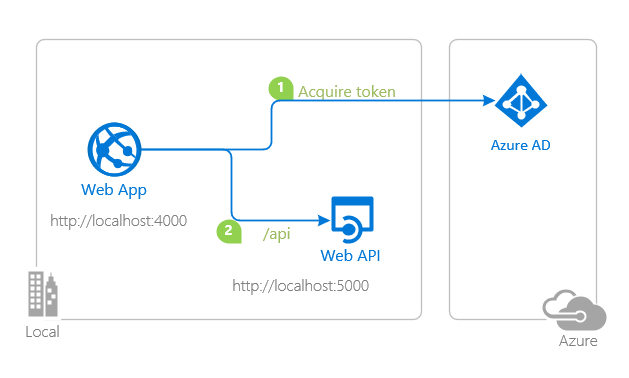
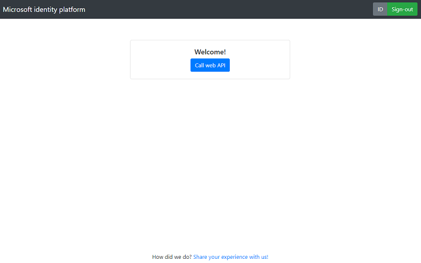

# A Node.js & Express web app calling a custom web API on Azure AD using MSAL Node

 1. [Overview](#overview)
 1. [Scenario](#scenario)
 1. [Contents](#contents)
 1. [Prerequisites](#prerequisites)
 1. [Setup](#setup)
 1. [Registration](#registration)
 1. [Running the sample](#running-the-sample)
 1. [Explore the sample](#explore-the-sample)
 1. [About the code](#about-the-code)
 1. [More information](#more-information)
 1. [Community Help and Support](#community-help-and-support)
 1. [Contributing](#contributing)

## Overview

This sample demonstrates a Node.js & Express web application calling a Node.js & Express web API protected by Azure AD using the [Microsoft Authentication Library for Node.js](https://aka.ms/msalnode) (MSAL Node). In doing so, it illustrates authorization concepts such as [OAuth 2.0 Authorization Code Grant](https://docs.microsoft.com/azure/active-directory/develop/v2-oauth2-auth-code-flow), [access token validation](https://docs.microsoft.com/azure/active-directory/develop/access-tokens#validating-tokens) and more.

## Scenario

1. The client application uses the **MSAL Node** to sign-in a user and obtain a JWT **Access Token** from **Azure AD**.
1. The **Access Token** is used as a *bearer* token to authorize the user to access the **resource**.
1. The **resource owner** responds with the resource that the user has access to.



## Contents

| File/folder                   | Description                                                   |
|-------------------------------|---------------------------------------------------------------|
| `AppCreationScripts/`         | Contains Powershell scripts to automate app registration.     |
| `ReadmeFiles/`                | Contains images and diagrams for the README.                  |
| `WebApp/appSettings.json`     | Contains authentication parameters for the web app.           |
| `WebApp/cache.json`           | Stores MSAL Node token cache.                                 |
| `WebApp/App/app.js`           | Web application entry point.                                  |
| `WebApp/App/routes/router.js` | Router configuration where authentication middleware added.   |
| `WebAPI/config.json`          | Contains authentication parameters for the web API.           |
| `WebAPI/index.js`             | web API entry point.                                          |

## Prerequisites

- [Node.js](https://nodejs.org/en/download/) must be installed to run this sample.
- [Visual Studio Code](https://code.visualstudio.com/download) is recommended for running and editing this sample.
- [VS Code Azure Tools](https://marketplace.visualstudio.com/items?itemName=ms-vscode.vscode-node-azure-pack) extension is recommended for interacting with Azure through VS Code Interface.
- A modern web browser. This sample uses **ES6** conventions and will not run on **Internet Explorer**.
- An **Azure AD** tenant. For more information, see: [How to get an Azure AD tenant](https://docs.microsoft.com/azure/active-directory/develop/quickstart-create-new-tenant)
- A user account in your **Azure AD** tenant. This sample will not work with a **personal Microsoft account**.  If you're signed in to the [Azure portal](https://portal.azure.com) with a personal Microsoft account and have not created a user account in your directory before, you will need to create one before proceeding.

## Setup

### Step 1: Clone or download this repository

From your shell or command line:

```console
    git clone https://github.com/Azure-Samples/ms-identity-javascript-nodejs-tutorial.git
```

or download and extract the repository .zip file.

> :warning: To avoid path length limitations on Windows, we recommend cloning into a directory near the root of your drive.

### Step 2: Install project dependencies

Locate the root of the sample folder. Then:

```console
    cd 3-Authorization-II/1-call-api/WebAPI
    npm install
    cd ../
    cd WebApp
    npm install
```

### Registration

There are two projects in this sample. Each needs to be separately registered in your Azure AD tenant. To register these projects, you can:

- follow the steps below for manually register your apps
- or use PowerShell scripts that:
  - **automatically** creates the Azure AD applications and related objects (passwords, permissions, dependencies) for you.
  - modify the projects' configuration files.

<details>
  <summary>Expand this section if you want to use this automation:</summary>

> :warning: If you have never used **Azure AD Powershell** before, we recommend you go through the [App Creation Scripts](./AppCreationScripts/AppCreationScripts.md) once to ensure that your environment is prepared correctly for this step.

1. On Windows, run PowerShell as **Administrator** and navigate to the root of the cloned directory
1. If you have never used Azure AD Powershell before, we recommend you go through the [App Creation Scripts](./AppCreationScripts/AppCreationScripts.md) once to ensure that your environment is prepared correctly for this step.
1. In PowerShell run:

   ```PowerShell
   Set-ExecutionPolicy -ExecutionPolicy RemoteSigned -Scope Process -Force
   ```

1. Run the script to create your Azure AD application and configure the code of the sample application accordingly.
1. In PowerShell run:

   ```PowerShell
   cd .\AppCreationScripts\
   .\Configure.ps1
   ```

   > Other ways of running the scripts are described in [App Creation Scripts](./AppCreationScripts/AppCreationScripts.md)
   > The scripts also provide a guide to automated application registration, configuration and removal which can help in your CI/CD scenarios.

</details>

### Choose the Azure AD tenant where you want to create your applications

As a first step you'll need to:

1. Sign in to the [Azure portal](https://portal.azure.com).
1. If your account is present in more than one Azure AD tenant, select your profile at the top right corner in the menu on top of the page, and then **switch directory** to change your portal session to the desired Azure AD tenant.

### Register the service app (msal-node-webapi)

1. Navigate to the [Azure portal](https://portal.azure.com) and select the **Azure AD** service.
1. Select the **App Registrations** blade on the left, then select **New registration**.
1. In the **Register an application page** that appears, enter your application's registration information:
   - In the **Name** section, enter a meaningful application name that will be displayed to users of the app, for example `msal-node-webapi`.
   - Under **Supported account types**, select **Accounts in this organizational directory only**.
1. Select **Register** to create the application.
1. In the app's registration screen, find and note the **Application (client) ID**. You use this value in your app's configuration file(s) later in your code.
1. Select **Save** to save your changes.
1. In the app's registration screen, select the **Certificates & secrets** blade in the left to open the page where you can generate secrets and upload certificates.
1. In the **Client secrets** section, select **New client secret**:
   - Type a key description (for instance `app secret`),
   - Select one of the available key durations (**6 months**, **12 months** or **Custom**) as per your security posture.
   - The generated key value will be displayed when you select the **Add** button. Copy and save the generated value for use in later steps.
   - You'll need this key later in your code's configuration files. This key value will not be displayed again, and is not retrievable by any other means, so make sure to note it from the Azure portal before navigating to any other screen or blade.
1. In the app's registration screen, select the **Expose an API** blade to the left to open the page where you can declare the parameters to expose this app as an API for which client applications can obtain [access tokens](https://docs.microsoft.com/azure/active-directory/develop/access-tokens) for.
The first thing that we need to do is to declare the unique [resource](https://docs.microsoft.com/azure/active-directory/develop/v2-oauth2-auth-code-flow) URI that the clients will be using to obtain access tokens for this API. To declare an resource URI, follow the following steps:
   - Select `Set` next to the **Application ID URI** to generate a URI that is unique for this app.
   - For this sample, accept the proposed Application ID URI (`api://{clientId}`) by selecting **Save**.
1. All APIs have to publish a minimum of one [scope](https://docs.microsoft.com/azure/active-directory/develop/v2-oauth2-auth-code-flow#request-an-authorization-code) for the client's to obtain an access token successfully. To publish a scope, follow these steps:
   - Select **Add a scope** button open the **Add a scope** screen and Enter the values as indicated below:
        - For **Scope name**, use `access_as_user`.
        - Select **Admins and users** options for **Who can consent?**.
        - For **Admin consent display name** type `Access msal-node-webapi`.
        - For **Admin consent description** type `Allows the app to access msal-node-webapi as the signed-in user.`
        - For **User consent display name** type `Access msal-node-webapi`.
        - For **User consent description** type `Allow the application to access msal-node-webapi on your behalf.`
        - Keep **State** as **Enabled**.
        - Select the **Add scope** button on the bottom to save this scope.
1. Select the `Manifest` blade on the left.
   - Set `accessTokenAcceptedVersion` property to **2**.
   - Click on **Save**.

#### Configure the service app (msal-node-webapi) to use your app registration

Open the project in your IDE (like Visual Studio or Visual Studio Code) to configure the code.

> In the steps below, "ClientID" is the same as "Application ID" or "AppId".

1. Open the `WebAPI\config.json` file.
1. Find the key `clientId` and replace the existing value with the application ID (clientId) of `msal-node-webapi` app copied from the Azure portal.
1. Find the key `tenantId` and replace the existing value with your Azure AD tenant ID.
1. Find the key `clientSecret` and replace the existing value with the key you saved during the creation of `msal-node-webapi` copied from the Azure portal.

### Register the client app (msal-node-webapp)

1. Navigate to the [Azure portal](https://portal.azure.com) and select the **Azure AD** service.
1. Select the **App Registrations** blade on the left, then select **New registration**.
1. In the **Register an application page** that appears, enter your application's registration information:
   - In the **Name** section, enter a meaningful application name that will be displayed to users of the app, for example `msal-node-webapp`.
   - Under **Supported account types**, select **Accounts in this organizational directory only**.
   - In the **Redirect URI (optional)** section, select **Web** in the combo-box and enter the following redirect URI: `http://localhost:4000/redirect`.
1. Select **Register** to create the application.
1. In the app's registration screen, find and note the **Application (client) ID**. You use this value in your app's configuration file(s) later in your code.
1. Select **Save** to save your changes.
1. In the app's registration screen, select the **Certificates & secrets** blade in the left to open the page where you can generate secrets and upload certificates.
1. In the **Client secrets** section, select **New client secret**:
   - Type a key description (for instance `app secret`),
   - Select one of the available key durations (**6 months**, **12 months** or **Custom**) as per your security posture.
   - The generated key value will be displayed when you select the **Add** button. Copy and save the generated value for use in later steps.
   - You'll need this key later in your code's configuration files. This key value will not be displayed again, and is not retrievable by any other means, so make sure to note it from the Azure portal before navigating to any other screen or blade.
1. In the app's registration screen, select the **API permissions** blade in the left to open the page where we add access to the APIs that your application needs.
   - Select the **Add a permission** button and then,
   - Ensure that the **My APIs** tab is selected.
   - In the list of APIs, select the API `msal-node-webapi`.
   - In the **Delegated permissions** section, select the **Access 'msal-node-webapi'** in the list. Use the search box if necessary.
   - Select the **Add permissions** button at the bottom.

#### Configure the client app (msal-node-webapp) to use your app registration

Open the project in your IDE (like Visual Studio or Visual Studio Code) to configure the code.

> In the steps below, "ClientID" is the same as "Application ID" or "AppId".

1. Open the `WebApp\appSettings.json` file.
1. Find the key `clientId` and replace the existing value with the application ID (clientId) of `msal-node-webapp` app copied from the Azure portal.
1. Find the key `tenantId` and replace the existing value with your Azure AD tenant ID.
1. Find the key `clientSecret` and replace the existing value with the key you saved during the creation of `msal-node-webapp` copied from the Azure portal.
1. Find the key `redirectUri` and replace the existing value with the Redirect URI for `msal-node-webapp`. (by default `http://localhost:4000/`).
1. Find the key `postLogoutRedirectUri` and replace the existing value with the base address of `msal-node-webapp` (by default `http://localhost:4000/`).

The rest of the **key-value** pairs are for resources/APIs that you would like to call. They are set as **default**, but you can modify them as you wish:

```json
   "<name of your resource>": {
      "callingPageRoute": "<route where this resource will be called from, e.g. '/webapi'>",
      "endpoint": "<URI coordinates of the resource, e.g. 'http://localhost:5000/myapi'>",
      "scopes": ["scope for the resource, e.g. 'api://xxxxxx/access_as_user' ", "..."]
   },
```

## Running the sample

Locate the root of the sample folder. Then:

```console
    cd WebAPI
    npm start
```

In a separate terminal window, type:

```console
    cd ../
    cd WebApp
    npm start
```

## Explore the sample

1. Open your browser and navigate to `http://localhost:4000`.
1. Select the **Sign-in** button on the top right corner.
1. Once you sign-in, select on the **Call web API**.



> :information_source: Did the sample not work for you as expected? Then please reach out to us using the [GitHub Issues](../../../../issues) page.

## We'd love your feedback!

Were we successful in addressing your learning objective? Consider taking a moment to [share your experience with us](https://forms.office.com/Pages/ResponsePage.aspx?id=v4j5cvGGr0GRqy180BHbR73pcsbpbxNJuZCMKN0lURpUQkRCSVdRSk8wUjdZSkg2NEZGOFFaTkxQVyQlQCN0PWcu).

## About the code

### Configuration

### Acquiring an access token

### Calling a web API

### Access Token validation

## More information

Configure your application:

- [Initialize client applications using MSAL.js](https://docs.microsoft.com/azure/active-directory/develop/msal-js-initializing-client-applications)
- [Single sign-on with MSAL.js](https://docs.microsoft.com/azure/active-directory/develop/msal-js-sso)
- [Handle MSAL.js exceptions and errors](https://docs.microsoft.com/azure/active-directory/develop/msal-handling-exceptions?tabs=javascript)
- [Logging in MSAL.js applications](https://docs.microsoft.com/azure/active-directory/develop/msal-logging?tabs=javascript)
- [Pass custom state in authentication requests using MSAL.js](https://docs.microsoft.com/azure/active-directory/develop/msal-js-pass-custom-state-authentication-request)
- [Prompt behavior in MSAL.js interactive requests](https://docs.microsoft.com/azure/active-directory/develop/msal-js-prompt-behavior)

Learn more about the Microsoft identity platform:

- [Microsoft identity platform (Azure Active Directory for developers)](https://docs.microsoft.com/azure/active-directory/develop/)
- [Overview of Microsoft Authentication Library (MSAL)](https://docs.microsoft.com/azure/active-directory/develop/msal-overview)
- [Understanding Azure AD application consent experiences](https://docs.microsoft.com/azure/active-directory/develop/application-consent-experience)
- [Understand user and admin consent](https://docs.microsoft.com/azure/active-directory/develop/howto-convert-app-to-be-multi-tenant#understand-user-and-admin-consent)
- [Microsoft identity platform and OpenID Connect protocol](https://docs.microsoft.com/azure/active-directory/develop/v2-protocols-oidc)
- [Microsoft Identity Platform ID Tokens](https://docs.microsoft.com/azure/active-directory/develop/id-tokens)

For more information about how OAuth 2.0 protocols work in this scenario and other scenarios, see [Authentication Scenarios for Azure AD](https://docs.microsoft.com/azure/active-directory/develop/authentication-flows-app-scenarios).

## Community Help and Support

Use [Stack Overflow](http://stackoverflow.com/questions/tagged/msal) to get support from the community.
Ask your questions on Stack Overflow first and browse existing issues to see if someone has asked your question before.
Make sure that your questions or comments are tagged with [`azure-active-directory` `node.js` `ms-identity` `adal` `msal`].

If you find a bug in the sample, raise the issue on [GitHub Issues](../../../../issues).

To provide feedback on or suggest features for Azure Active Directory, visit [User Voice page](https://feedback.azure.com/forums/169401-azure-active-directory).

## Contributing

If you'd like to contribute to this sample, see [CONTRIBUTING.MD](/CONTRIBUTING.md).

This project has adopted the [Microsoft Open Source Code of Conduct](https://opensource.microsoft.com/codeofconduct/). For more information, see the [Code of Conduct FAQ](https://opensource.microsoft.com/codeofconduct/faq/) or contact [opencode@microsoft.com](mailto:opencode@microsoft.com) with any additional questions or comments.