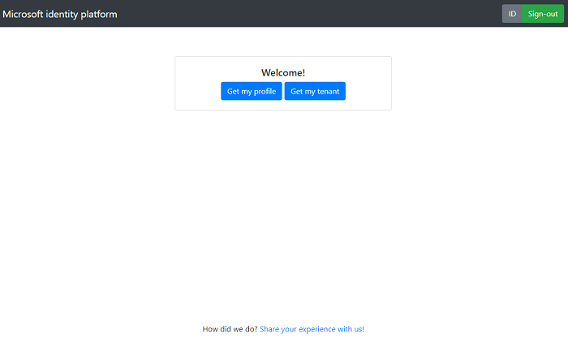

# Deploy your apps to Azure Cloud using App Service and Key Vault

 1. [Overview](#overview)
 1. [Scenario](#scenario)
 1. [Prerequisites](#prerequisites)
 1. [Setup](#setup)
 1. [Registration](#registration)
 1. [Deployment](#deployment)
 1. [Explore the sample](#explore-the-sample)
 1. [More information](#more-information)
 1. [Community Help and Support](#community-help-and-support)
 1. [Contributing](#contributing)

## Overview

This sample demonstrates how to deploy a Node.js & Express web application to **Azure Cloud** using the [Azure App Service](https://docs.microsoft.com/azure/app-service/). The application used in this sample is a slightly modified version of the web app from [**chapter 2.1**](../2-Authorization/1-call-graph/README.md). The steps here apply similarly to Azure AD and Azure AD B2C apps.

One of the principles of security is to place credentials like secrets and certificates out of your code and use it in a manner that allows them to be replaced or rotated without incurring a downtime. As such, this sample also uses the [Azure Key Vault](https://docs.microsoft.com/azure/key-vault/general/about-keys-secrets-certificates) to store client secrets safely on the cloud.

## Scenario

1. The client application uses the **MSAL Node** (via [microsoft-identity-express](https://github.com/Azure-Samples/microsoft-identity-express)) to sign-in a user and obtain a JWT **Access Token** from **Azure AD**.
1. The **Access Token** is used as a *bearer* token to authorize the user to access the **resource** (MS Graph).
1. The **resource server** responds with the resource that the user has access to.


## Prerequisites

- [VS Code Azure Tools Extension](https://marketplace.visualstudio.com/items?itemName=ms-vscode.vscode-node-azure-pack) extension is recommended for interacting with **Azure** through VS Code interface.
- An **Azure AD** tenant. For more information, see: [How to get an Azure AD tenant](https://azure.microsoft.com/documentation/articles/active-directory-howto-tenant/)
- A user account in your **Azure AD** tenant.
- An **Azure subscription**. This sample uses **Azure App Service** and **Azure Key Vault**.

## Setup

### Step 1: Clone or download this repository

From your shell or command line:

```console
    git clone https://github.com/Azure-Samples/ms-identity-javascript-nodejs-tutorial.git
```

or download and extract the repository .zip file.

> :warning: To avoid path length limitations on Windows, we recommend cloning into a directory near the root of your drive.

### Step 2: Install project dependencies

Locate the root of the sample folder. Then:

```console
    cd 3-Deployment/App
    npm install
```

## Registration

### Register the app

Use the same app registration credentials that you've obtained during [**chapter 2.1**](../2-Authorization/1-call-graph/README.md#registration). Leave out the `clientSecret`, however, as we will fetch secrets from **Azure Key Vault** instead.

## Deployment

There are basically **2** stages that you will have to go through in order to deploy your projects and enable authentication:

1. Upload your project files to **Azure** services and obtain published website URIs
1. Update **Azure AD** **App Registration** with URIs you have just obtained

There are various ways to upload your files to **Azure App Service**. Here we provide steps for uploading via **VS Code Azure Tools Extension**.

> We recommend watching the [video tutorial](https://docs.microsoft.com/azure/developer/javascript/tutorial-vscode-azure-app-service-node-01) offered by Microsoft Docs for preparation.

### Deploy the web app

#### Step 1: Deploy your files

1. In the **VS Code** activity bar, select the **Azure** logo to show the **Azure App Service** explorer. Select **Sign in to Azure...** and follow the instructions. Once signed in, the explorer should show the name of your **Azure** subscription(s).


2. On the **App Service** explorer section you will see an **upward-facing** arrow icon. Click on it publish your local files in the `App` folder to **Azure App Services**. You may also right-click to the `App` folder to access it via the context menu.


3. Choose a creation option based on the operating system to which you want to deploy. In this sample, we choose **Linux**.
4. Select a Node.js version when prompted. An **LTS** version is recommended (>=12).
5. Type a globally unique name for your web API and press Enter. The name must be unique across all of **Azure**. (e.g. `example-express-webapp1`)
6. After you respond to all the prompts, **VS Code** shows the **Azure** resources that are being created for your app in its notification popup.
7. Select **Yes** when prompted to update your configuration to run npm install on the target Linux server.


#### Step 2: Update Azure AD App Registration

Navigate to the [Azure portal](https://portal.azure.com) and select the **Azure AD** service.

1. Select the **App Registrations** blade on the left, then find and select the web app that you have registered in the previous tutorial (`example-express-webapp1`).
1. Navigate to the **Authentication** blade. There, in **Redirect URI** section, enter the published URL website, for instance: `https://example-express-webapp1.azurewebsites.net/redirect`.
1. Select **Save** to save your changes.

### Enable your web app to get secrets from Key Vault using Managed Identity

To achieve this we'll place our application's credentials in [Azure Key Vault](https://azure.microsoft.com/services/key-vault/) and access it via [managed Identities for Azure resources](https://docs.microsoft.com/azure/active-directory/managed-identities-azure-resources/overview).

#### Set up your Managed Identity

1. Navigate to [Azure portal](https://portal.azure.com) and select the **Azure App Service**.
1. Find and select the App Service you've created previously.
1. On App Service portal, select **Identity**.
1. Within the **System assigned** tab, switch **Status** to **On**. Click **Save**.
1. Record the **Object Id** that will appear, as you will need it in the next step.

For more information, see [Add a system-assigned identity](https://docs.microsoft.com/azure/app-service/overview-managed-identity?tabs=dotnet#add-a-system-assigned-identity)

#### Set up your Key vault

Before starting here, make sure:

- You have an [Azure Subscription](https://azure.microsoft.com/free/).
- You have a working and deployed application as an Azure App Service following the steps listed at [Deploy the web app](#deploy-the-web-app) above.
- Follow the guide to [create an Azure Key Vault](https://docs.microsoft.com/azure/key-vault/general/quick-create-portal). Steps below are summarized.

##### Upload your secret to KeyVault

1. Navigate to your new key vault in the Azure portal.
1. On the Key Vault settings pages, select **Secrets**.
1. Click on **Generate/Import**.
1. On the **Create a secret** screen choose the following values:
    - **Upload options**: Manual.
    - **Name**: Type a name for the secret. The secret name must be unique within a Key Vault. For example, `ExampleSecret`
    - **Value**: Copy and paste the value of the `clientSecret` for your App. You can use the secret you created in the previous tutorial. If you forgot it and cannot access it again, simply create a new one.
    - Leave the other values to their defaults. Click **Create**.

##### Provide the managed identity access to Key Vault

1. Navigate to your Key Vault in the portal.
1. Select **Overview** > **Access policies**.
1. Click on **Add Access Policy**.
1. In the input box for **Secret permissions**, select **Get**.
1. Click on **Select Principal**, add the **system-assigned managed identity** that you have created in the [steps before](#set-up-your-managed-identity). You can use the **Object Id** you have recorded previously to search for it.
1. Click on **OK** to add the new Access Policy, then click **Save** to save the Access Policy.

#### Add environment variables to App Service

Finally, you need to add a few environment variables to the App Service where you deployed your web app.

1. In the [Azure portal](https://portal.azure.com) , search for and select **App Service**, and then select your app.
1. Select **Configuration** blade on the left, then select **New Application Settings**.
1. Add the following variables (name-value):
    1. **KEY_VAULT_URI**: the name of the key vault you've created, e.g. `example-key-vault`
    1. **SECRET_NAME**: the name of the certificate you specified when importing it to key vault, e.g. `ExampleSecret`
    1. **NODE_ENV**: enter `production` (:information_source: this enables your application to set cookies to secure and trust App service proxy)

Wait for a few minutes for your changes on **App Service** to take effect. You should then be able to visit your published website and sign-in accordingly.

## Explore the sample

1. Open your browser and navigate to your deployed client app's URI, for instance: `https://example-express-webapp1.azurewebsites.net/`.
1. Click on the **sign-in** button located on the top right corner.
1. Once you sign in, click on the **See my profile** button to call **Microsoft Graph**.
1. Once you sign in, click on the **Get my tenant** button to call **Azure Resource Manager**.



## We'd love your feedback!

Were we successful in addressing your learning objective? Consider taking a moment to [share your experience with us](https://forms.office.com/Pages/ResponsePage.aspx?id=v4j5cvGGr0GRqy180BHbR73pcsbpbxNJuZCMKN0lURpUQkRCSVdRSk8wUjdZSkg2NEZGOFFaTkxQVyQlQCN0PWcu).

## About the code

### Accessing Key Vault using Managed Identity

In [app.js](./App/app.js), we instantiate an **MsalWebAppAuthClient** object asynchronously using the [buildAsync](https://azure-samples.github.io/microsoft-identity-express/classes/WebAppAuthClientBuilder.html#buildasync) method of [WebAppAuthClientBuilder](https://azure-samples.github.io/microsoft-identity-express/classes/WebAppAuthClientBuilder.html). To do so, we need to start the express server asynchronously:

```javascript
const express = require('express');
const session = require('express-session');
const MsIdExpress = require('microsoft-identity-express');
const appSettings = require('./appSettings');

async function main() {
    const app = express();

    app.use(session({
        secret: 'ENTER_YOUR_SECRET_HERE',
        resave: false,
        saveUninitialized: false,
        cookie: {
            secure: true, 
        }
    }));

    app.set('trust proxy', 1);

    try {
        const msid = await new MsIdExpress.WebAppAuthClientBuilder(appSettings)
            .withKeyVaultCredentials({
                credentialType: "clientSecret",
                credentialName: process.env["SECRET_NAME"],
                keyVaultUrl: process.env["KEY_VAULT_URI"]
            }).buildAsync();

        app.use(msid.initialize());

        app.use(mainRouter(msid));

        app.listen(SERVER_PORT, () => console.log(`Server is listening on port ${SERVER_PORT}!`));
    } catch (error) {
        console.log(error);
    }
}

main();
```

Under the hood, the wrapper calls the **Azure Key Vault** to access credentials needed for the application to authenticate with Azure AD using the [KeyVaultManager](https://azure-samples.github.io/microsoft-identity-express/classes/keyvaultmanager.html) class. This class is leveraging the [@azure/identity](https://www.npmjs.com/package/@azure/identity) and [@azure/key-vault](https://www.npmjs.com/package/@azure/keyvault-secrets) packages:

```typescript
import { DefaultAzureCredential } from "@azure/identity";
import { CertificateClient, KeyVaultCertificate } from "@azure/keyvault-certificates";
import { KeyVaultSecret, SecretClient } from "@azure/keyvault-secrets";

import { KeyVaultCredential, ClientCertificate } from "../config/AppSettings";
import { KeyVaultCredentialTypes } from "../utils/Constants";

export type KeyVaultCredentialResponse = {
    type: KeyVaultCredentialTypes.SECRET | KeyVaultCredentialTypes.CERTIFICATE,
    value: string & ClientCertificate
}

export class KeyVaultManager {
    async getCredentialFromKeyVault(keyVaultCredential: KeyVaultCredential): Promise<KeyVaultCredentialResponse> {

        const credential = new DefaultAzureCredential();

        switch (keyVaultCredential.credentialType) {
            case KeyVaultCredentialTypes.SECRET: {
                try {
                    const secretResponse = await this.getSecretCredential(keyVaultCredential, credential);

                    return {
                        type: KeyVaultCredentialTypes.SECRET,
                        value: secretResponse.value,
                    } as KeyVaultCredentialResponse;

                } catch (error) {
                    console.log(error);
                }
                break;
            }

            // ...

            default:
                break;
        }
    };

    async getSecretCredential(keyVaultCredential: KeyVaultCredential, credential: DefaultAzureCredential): Promise<KeyVaultSecret> {

        // Initialize secretClient with credentials
        const secretClient = new SecretClient(keyVaultCredential.keyVaultUrl, credential);

        try {
            const keyVaultSecret = await secretClient.getSecret(keyVaultCredential.credentialName);
            return keyVaultSecret;
        } catch (error) {
            console.log(error);
            return error;
        }
    }
}
```

## More information

- [Azure App Services](https://docs.microsoft.com/azure/app-service/)
- [Azure Key Vault](https://docs.microsoft.com/azure/key-vault/general/about-keys-secrets-certificates)
- [Azure Managed Identity](https://docs.microsoft.com/azure/active-directory/managed-identities-azure-resources/overview)

For more information about how OAuth 2.0 protocols work in this scenario and other scenarios, see [Authentication Scenarios for Azure AD](https://docs.microsoft.com/azure/active-directory/develop/authentication-flows-app-scenarios).

## Community Help and Support

Use [Stack Overflow](http://stackoverflow.com/questions/tagged/msal) to get support from the community.
Ask your questions on Stack Overflow first and browse existing issues to see if someone has asked your question before.
Make sure that your questions or comments are tagged with [`azure-ad` `node` `ms-identity` `msal`].

If you find a bug in the sample, please raise the issue on [GitHub Issues](../../../issues).

To provide a recommendation, visit the following [User Voice page](https://feedback.azure.com/forums/169401-azure-active-directory).

## Contributing

If you'd like to contribute to this sample, see [CONTRIBUTING.MD](../../CONTRIBUTING.md).

This project has adopted the [Microsoft Open Source Code of Conduct](https://opensource.microsoft.com/codeofconduct/). For more information, see the [Code of Conduct FAQ](https://opensource.microsoft.com/codeofconduct/faq/) or contact [opencode@microsoft.com](mailto:opencode@microsoft.com) with any additional questions or comments.
