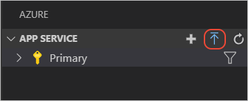

# Deploy your Node.js & Express web app to Azure Cloud

 1. [Overview](#overview)
 1. [Scenario](#scenario)
 1. [Prerequisites](#prerequisites)
 1. [Setup](#setup)
 1. [Registration](#registration)
 1. [Deployment](#deployment)
 1. [Explore the sample](#explore-the-sample)
 1. [More information](#more-information)
 1. [Community Help and Support](#community-help-and-support)
 1. [Contributing](#contributing)

## Overview

This sample demonstrates how to deploy a Node.js & Express web application coupled with a Node.js & Express web API to **Azure Cloud** using the [Azure App Service](https://docs.microsoft.com/azure/app-service/). To do so, we will use the [same code sample from Chapter 3](../3-Authorization-II/1-call-api).

> :information_source: The steps below apply similarly to B2C applications, for instance the [B2C sample from Chapter 3](../3-Authorization-II/2-call-api-b2c)

## Scenario

1. The client application uses the **MSAL Node** library to sign-in a user and obtain a JWT **Access Token** from **Azure AD**.
1. The **Access Token** is used as a **bearer** token to *authorize* the user to call the protected web API.
1. The protected web API responds with the claims in the **Access Token**.


## Prerequisites

- [VS Code Azure Tools Extension](https://marketplace.visualstudio.com/items?itemName=ms-vscode.vscode-node-azure-pack) extension is recommended for interacting with **Azure** through VS Code interface.
- An **Azure AD** tenant. For more information, see: [How to get an Azure AD tenant](https://azure.microsoft.com/documentation/articles/active-directory-howto-tenant/)
- A user account in your **Azure AD** tenant.
- An **Azure subscription**. This sample uses **Azure App Service**.

## Setup

Locate the root of the [sample folder](../3-Authorization-II/1-call-api). Then:

```console
    cd WebAPI
    npm install
    cd ../
    cd WebApp
    npm install
```

## Registration

### Register the web API

Use the same app registration credentials that you've obtained during [**chapter 3-1**](../3-Authorization-II/3-1-call-api). You may copy-paste the contents of your `config.json` file to do so.

### Register the web app

Use the same app registration credentials that you've obtained during [**chapter 3-1**](../3-Authorization-II/3-1-call-api). You may copy-paste the contents of your `appSettings.json` file to do so.

## Deployment

There are basically **3** stages that you will have to go through in order to deploy your projects and enable authentication:

1. Upload your project files to **Azure** services and obtain published website URIs
1. Update **Azure AD** **App Registration** with URIs you have just obtained
1. Update your configuration files with URIs you have just obtained

There are various ways to upload your files to **Azure App Service**. Here we provide steps for uploading via **VS Code Azure Tools Extension**.

> We recommend watching the [video tutorial](https://docs.microsoft.com/azure/developer/javascript/tutorial-vscode-azure-app-service-node-01) offered by Microsoft Docs for preparation.

### Deploy the web API

#### Step 1: Deploy your files

1. In the **VS Code** activity bar, select the **Azure** logo to show the **Azure App Service** explorer. Select **Sign in to Azure...** and follow the instructions. Once signed in, the explorer should show the name of your **Azure** subscription(s).


2. On the **App Service** explorer section you will see an upward-facing arrow icon. Click on it publish your local files in the `WebAPI` folder to **Azure App Services**.



3. Choose a creation option based on the operating system to which you want to deploy. in this sample, we choose **Linux**.
4. Select a Node.js version when prompted. An **LTS** version is recommended.
5. Type a globally unique name for your web API and press Enter. The name must be unique across all of **Azure**. (e.g. `msal-nodejs-webapi1`)
6. After you respond to all the prompts, **VS Code** shows the **Azure** resources that are being created for your app in its notification popup.
7. Select **Yes** when prompted to update your configuration to run npm install on the target Linux server.


#### Step 2: Disable default authentication

Now you need to navigate to the **Azure App Service** Portal, and locate your project there. Once you do, click on the **Authentication/Authorization** blade. There, make sure that the **App Services Authentication** is switched off (and nothing else is checked), as we are using our own **custom** authentication logic.


### Deploy the web app

> :information_source: The steps below are the same with deploying your web API, except for step 3 where we reconfigure `appSettings.json` for the web app.

#### Step 1: Deploy your files

1. In the **VS Code** activity bar, select the **Azure** logo to show the **Azure App Service** explorer. Select **Sign in to Azure...** and follow the instructions. Once signed in, the explorer should show the name of your **Azure** subscription(s).
2. On the **App Service** explorer section you will see an upward-facing arrow icon. Click on it publish your local files in the `WebApp` folder to **Azure App Services** (use "Browse" option if needed, and locate the right folder).
3. Choose a creation option based on the operating system to which you want to deploy. in this sample, we choose **Linux**.
4. Select a Node.js version when prompted. An **LTS** version is recommended.
5. Type a globally unique name for your web app and press Enter. The name must be unique across all of **Azure**. (e.g. `msal-nodejs-webapp1`)
6. After you respond to all the prompts, **VS Code** shows the **Azure** resources that are being created for your app in its notification popup.
7. Select **Yes** when prompted to update your configuration to run npm install on the target Linux server.

#### Step 2: Disable default authentication

Now you need to navigate to the **Azure App Service** Portal, and locate your project there. Once you do, click on the **Authentication/Authorization** blade. There, make sure that the **App Services Authentication** is switched off (and nothing else is checked), as we are using our own **custom** authentication logic.

#### Step 3: Update your authentication configuration

Now we need to obtain authentication parameters. There are 2 things to do:

- Update Azure AD (or Azure AD B2C) **App Registration**
- Update `WebApp/appSettings.json`.

First, navigate to the [Azure portal](https://portal.azure.com) and select the **Azure AD** service.

1. Select the **App Registrations** blade on the left, then find and select the web app that you have registered in the previous tutorial (`msal-node-webapp`).
1. Navigate to the **Authentication** blade. There, in **Redirect URI** section, enter the following redirect URI: `https://msal-node-webapp1.azurewebsites.net/redirect`.
1. Select **Save** to save your changes.

Now, open the `WebApp/appSettings.json` that you have deployed to **Azure App Service**.


1. Find the key `redirectUri` and replace the existing value with the Redirect URI for ExpressWebApp-c3s1 app. For example, `https://msal-node-webapp1.azurewebsites.net/redirect`.
1. Find the key `postLogoutRedirectUri` and replace the existing value with the base address of the ExpressWebApp-c3s1 project (by default `https://msal-node-webapp1.azurewebsites.net/redirect/`).
1. Find the key `resources.webAPI.endpoint` and replace the existing value with your deployed web API's URI and endpoint, e.g. `https://msal-node-webapi1.azurewebsites.net/api`

## Explore the sample

1. Open your browser and navigate to your deployed client app's URI, for instance: `https://msal-node-webapp1.azurewebsites.net/`.
1. Click on the **sign-in** button located on the top right corner.
1. Once you authenticate, click on the **Call web API** button at the center.


## We'd love your feedback!

Were we successful in addressing your learning objective? Consider taking a moment to [share your experience with us](https://forms.office.com/Pages/ResponsePage.aspx?id=v4j5cvGGr0GRqy180BHbR73pcsbpbxNJuZCMKN0lURpUQkRCSVdRSk8wUjdZSkg2NEZGOFFaTkxQVyQlQCN0PWcu).

## More information

- [Azure App Services](https://docs.microsoft.com/azure/app-service/)

For more information about how OAuth 2.0 protocols work in this scenario and other scenarios, see [Authentication Scenarios for Azure AD](https://docs.microsoft.com/azure/active-directory/develop/authentication-flows-app-scenarios).

## Community Help and Support

Use [Stack Overflow](http://stackoverflow.com/questions/tagged/msal) to get support from the community.
Ask your questions on Stack Overflow first and browse existing issues to see if someone has asked your question before.
Make sure that your questions or comments are tagged with [`azure-ad` `azure-ad-b2c` `ms-identity` `msal`].

If you find a bug in the sample, please raise the issue on [GitHub Issues](../../../../issues).

To provide a recommendation, visit the following [User Voice page](https://feedback.azure.com/forums/169401-azure-active-directory).

## Contributing

If you'd like to contribute to this sample, see [CONTRIBUTING.MD](../../CONTRIBUTING.md).

This project has adopted the [Microsoft Open Source Code of Conduct](https://opensource.microsoft.com/codeofconduct/). For more information, see the [Code of Conduct FAQ](https://opensource.microsoft.com/codeofconduct/faq/) or contact [opencode@microsoft.com](mailto:opencode@microsoft.com) with any additional questions or comments.
