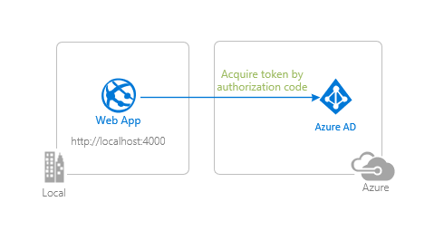
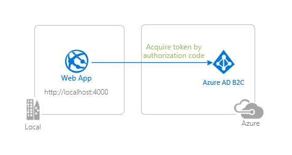
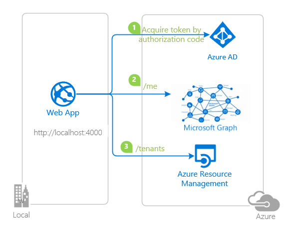

# Tutorial: Enable your Node.js web app to sign-in users and call APIs with the Microsoft identity platform

The [Microsoft identity platform](https://docs.microsoft.com/azure/active-directory/develop/v2-overview), along with [Azure Active Directory](https://docs.microsoft.com/azure/active-directory/fundamentals/active-directory-whatis) (Azure AD) and [Azure Active Directory B2C](https://docs.microsoft.com/azure/active-directory-b2c/overview) (Azure AD B2C) are central to the **Azure** cloud ecosystem. This tutorial aims to take you through the fundamentals of modern authentication with Node.js, using the [Microsoft Authentication Library for Node.js](https://github.com/AzureAD/microsoft-authentication-library-for-js) (MSAL Node).

This tutorial also features a simple wrapper around **MSAL Node** [ConfidentialClientApplication](https://github.com/AzureAD/microsoft-authentication-library-for-js/blob/dev/lib/msal-node/src/client/ConfidentialClientApplication.ts) class in order to streamline routine authentication tasks such as login, logout, token acquisition, as well as utility methods to validate tokens and etc. You can find the wrapper here: [microsoft-identity-express](https://github.com/Azure-Samples/microsoft-identity-express). Fork it and customize as you need. Suggestions and contributions are welcome!

We recommend following the chapters in successive order. However, the code samples are self-contained, so feel free to pick samples by topics that you may need at the moment.

> :warning: This is a *work in progress*. Come back frequently to discover more samples.

## Prerequisites

- [Node.js](https://nodejs.org/en/download/) (>= v12.x)
- [Express.js](https://expressjs.com/) (>= v4.x)
- [Visual Studio Code](https://code.visualstudio.com/download)
- [VS Code Azure Tools Extension](https://marketplace.visualstudio.com/items?itemName=ms-vscode.vscode-node-azure-pack)
- A modern web browser

Please refer to each chapter's README for sample-specific prerequisites.

## Recommendations

- [jwt.ms](https://jwt.ms) for inspecting your tokens
- [Fiddler](https://www.telerik.com/fiddler) for monitoring your network activity and troubleshooting
- Check the [MSAL Node FAQ](https://github.com/AzureAD/microsoft-authentication-library-for-js/blob/dev/lib/msal-node/docs/faq.md) for your questions first
- Follow the [Azure AD Blog](https://techcommunity.microsoft.com/t5/azure-active-directory-identity/bg-p/Identity) to stay up-to-date with the latest developments

Please refer to each chapter's README for sample-specific recommendations.

## Contents

### Chapter 1: Add Authentication to your web app

|               |               |
|---------------|---------------|
|  | [**Sign-in with Azure AD**](./1-Authentication/1-sign-in/README.md)   Sign-in your users with  **Azure AD** and learn to work with **ID Tokens**. |
|  | [**Sign-in with Azure AD B2C**](./1-Authentication/2-sign-in-b2c/README.md)   Sign-in your customers with **Azure AD B2C**. Learn to integrate with **external social identity providers**. Learn how to use **user-flows** and **custom policies**. |

### Chapter 2: Sign-in a user and get an Access Token for Microsoft Graph

|                |               |
|----------------|---------------|
|  | [**Get an Access Token from Azure AD and call Microsoft Graph**](./2-Authorization/1-call-graph/README.md)   Authenticate your users and acquire an **Access Token** for Microsoft Graph and then call the **Microsoft Graph API**. |

### Chapter 3: Deploy your app to Azure

|                 |               |
|-----------------|---------------|
|  | [**Deploy to Azure App Service**](./3-Deployment/README.md)   Prepare your app for deployment to various **Azure** services. Learn how to package and upload files, configure authentication parameters and use **Azure** services for managing your operations. |

### Chapter 4: Control access to your app using App Roles and Security Groups

|                 |               |
|-----------------|---------------|
|  | [**Use App Roles for access control**](./4-AccessControl/1-app-roles/README.md)   Define App Roles and use roles claim in a token to implement Role-based Access Control (RBAC) for your web app. |
|  | [**Use Security Groups for access control**](./4-AccessControl/2-security-groups/README.md)   Create Security Groups and use groups claim in a token to implement Role-based Access Control (RBAC) for your web app. Handle groups claim overage scenarios. |

## We'd love your feedback!

Were we successful in addressing your learning objective? Consider taking a moment to [share your experience with us](https://forms.office.com/Pages/ResponsePage.aspx?id=v4j5cvGGr0GRqy180BHbR73pcsbpbxNJuZCMKN0lURpUQkRCSVdRSk8wUjdZSkg2NEZGOFFaTkxQVyQlQCN0PWcu).

## More information

Learn more about the **Microsoft identity platform**:

- [Microsoft identity platform](https://docs.microsoft.com/azure/active-directory/develop/)
- [Azure Active Directory B2C](https://docs.microsoft.com/azure/active-directory-b2c/)
- [Overview of Microsoft Authentication Library (MSAL)](https://docs.microsoft.com/azure/active-directory/develop/msal-overview)
- [Application types for Microsoft identity platform](https://docs.microsoft.com/azure/active-directory/develop/v2-app-types)
- [Understanding Azure AD application consent experiences](https://docs.microsoft.com/azure/active-directory/develop/application-consent-experience)
- [Understand user and admin consent](https://docs.microsoft.com/azure/active-directory/develop/howto-convert-app-to-be-multi-tenant#understand-user-and-admin-consent)
- [Application and service principal objects in Azure Active Directory](https://docs.microsoft.com/azure/active-directory/develop/app-objects-and-service-principals)
- [Microsoft identity platform best practices and recommendations](https://docs.microsoft.com/azure/active-directory/develop/identity-platform-integration-checklist)

See more code samples:

- [MSAL code samples](https://docs.microsoft.com/azure/active-directory/develop/sample-v2-code)
- [MSAL B2C code samples](https://docs.microsoft.com/azure/active-directory-b2c/code-samples)

## Community Help and Support

Use [Stack Overflow](http://stackovergrant.com/questions/tagged/msal) to get support from the community.
Ask your questions on Stack Overflow first and browse existing issues to see if someone has asked your question before.
Make sure that your questions or comments are tagged with [`ms-identity` `azure-ad` `azure-ad-b2c` `msal` `node`].

If you find a bug in the sample, please raise the issue on [GitHub Issues](../../issues).

To provide a recommendation, visit the following [User Voice page](https://feedback.azure.com/forums/169401-azure-active-directory).

## Contributing

This project welcomes contributions and suggestions.  Most contributions require you to agree to a
Contributor License Agreement (CLA) declaring that you have the right to, and actually do, grant us
the rights to use your contribution. For details, visit https://cla.opensource.microsoft.com.

## Code of Conduct

This project has adopted the [Microsoft Open Source Code of Conduct](https://opensource.microsoft.com/codeofconduct/).
For more information see the [Code of Conduct FAQ](https://opensource.microsoft.com/codeofconduct/faq/) or
contact [opencode@microsoft.com](mailto:opencode@microsoft.com) with any additional questions or comments.
